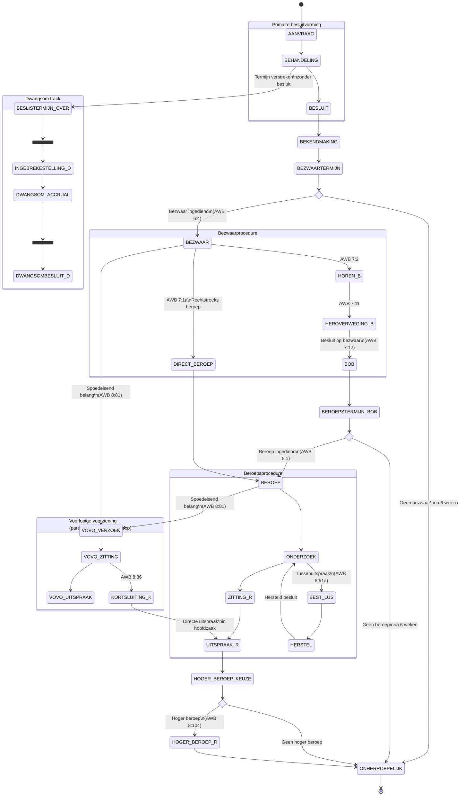
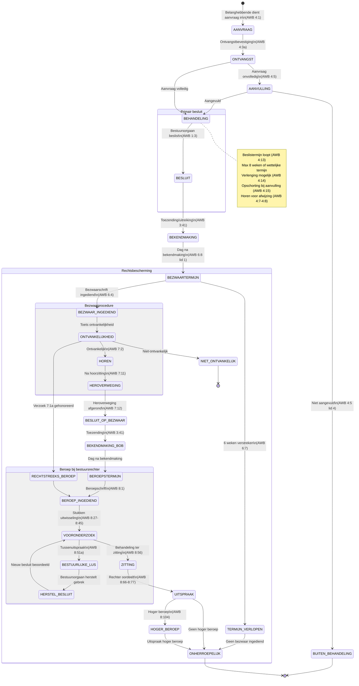
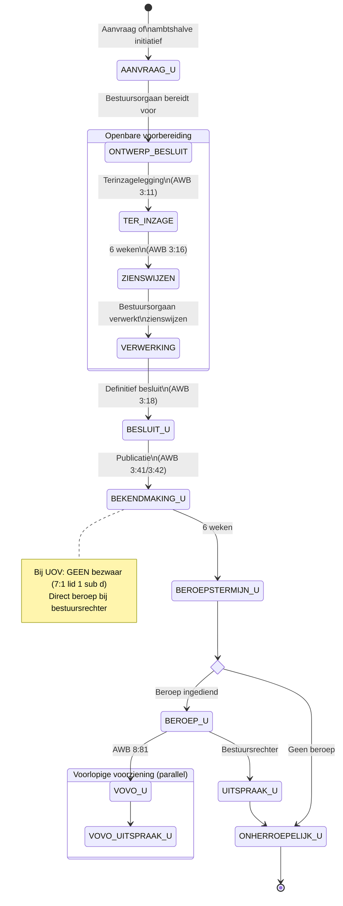
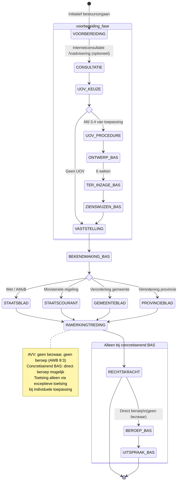

# RFC-008: Bestuursrecht — AWB Procedures

**Status:** Proposed
**Date:** 2026-03-21
**Authors:** Eelco Hotting
**Depends on:** RFC-007 (Cross-Law Execution Model)

## Context

RFC-007 introduced hooks: articles that fire when another article's `produces` annotation matches. This enables reactive execution — AWB 3:46 (reasoning requirement, *motiveringsplicht*) fires on any BESCHIKKING, AWB 6:7 (objection period, *bezwaartermijn*) fires on any BESCHIKKING, AWB 6:8 (start/einddatum) fires on any BESCHIKKING.

But an individual decision (*beschikking*) is not an instant computation. It is an administrative law (*bestuursrecht*) process that progresses through stages over time:

1. The interested party (*belanghebbende*) submits an **application** (*aanvraag*, AWB 4:1).
2. The administrative body (*bestuursorgaan*) investigates during the **processing** (*behandeling*) phase, possibly requesting additional information (AWB 4:5), possibly extending the decision deadline (*beslistermijn*, AWB 4:14). This can take weeks, months, or in complex cases years.
3. The administrative body (*bestuursorgaan*) makes a **decision** (*besluit*, AWB 1:3).
4. The decision (*besluit*) is communicated to the interested party (*belanghebbende*): **notification** (*bekendmaking*, AWB 3:41).
5. The **objection period** (*bezwaartermijn*) starts the day after notification (*bekendmaking*, AWB 6:8 lid 1) and runs for six weeks (AWB 6:7).
6. The interested party (*belanghebbende*) may file an **objection** (*bezwaar*, AWB 6:4).

If hooks fire without awareness of lifecycle stages, all AWB obligations trigger at once — including AWB 6:8 (objection period date calculation), which needs `bekendmaking_datum`. But notification (*bekendmaking*) hasn't happened yet at decision time. Treating a missing `bekendmaking_datum` as "skip this hook gracefully" is a workaround, not a design.

The problem: **the decision and the notification (*bekendmaking*) are different moments in time, with different inputs, producing different outputs, governed by different articles of law.** They must not fire in the same execution step.

### Who defines the lifecycle?

The lifecycle of an individual decision (*beschikking*) is not defined by the Vreemdelingenwet or the Zorgtoeslagwet. It is defined by the **Algemene wet bestuursrecht (AWB)** — the General Administrative Law Act. That is the purpose of the AWB: to define the general administrative procedure that all administrative bodies (*bestuursorganen*) follow, regardless of which specific law they are executing.

The AWB defines stages. Specific laws fill in the content at each stage. Other laws (Termijnenwet, KB gelijkgestelde dagen) hook into specific stages. This relationship already exists in law — it needs to be expressed in the schema.

### Terminology: procedure vs. lifecycle

In AWB terminology, what we describe here is a **procedure** — the objection procedure, the appeal procedure, the preparation procedure. The AWB never uses the word "lifecycle"; that is software engineering jargon.

However, in the AWB "procedure" typically refers to one phase (the objection (*bezwaar*) procedure, the appeal (*beroep*) procedure). The entire journey from application (*aanvraag*) to final/irrevocable (*onherroepelijk*) spans *multiple* procedures. In engineering, "lifecycle" captures this overarching concept: the full life of a decision (*besluit*) from birth (application) to final state (final/irrevocable (*onherroepelijk*), withdrawn (*ingetrokken*), or expired).

This RFC uses both terms deliberately:
- **Procedure** (`procedure:` in YAML): the domain term, used in the machine-readable specification because the YAML is a law specification and should speak the language of law.
- **Lifecycle**: used in prose when discussing the engineering concept of an entity progressing through states over time.

Both refer to the same thing: the AWB-defined sequence of stages that a decision (*besluit*) progresses through.

### What goes wrong without lifecycle stages

1. **Semantic confusion**: AWB 6:8 hooks on BESCHIKKING but should only fire when notification (*bekendmaking*) has occurred. Without stages, parameter absence becomes implicit control flow.
2. **Incorrect composition**: hooks that belong to different stages fire in the same execution, mixing outputs from different moments in time.
3. **No way to model waiting**: an engine without stages cannot express "the decision (*besluit*) is taken, now waiting for notification (*bekendmaking*)."
4. **Manual actions invisible**: an administrative body (*bestuursorgaan*)'s investigation, decision-making, and notification (*bekendmaking*) are real-world actions that the law regulates (decision deadline (*beslistermijn*) per AWB 4:13) but cannot be represented without stages.

## Decision

### The lifecycle is law

The AWB defines a **lifecycle** for administrative law (*bestuursrecht*) processes. This lifecycle is expressed in the YAML specification as a first-class construct. Laws do not define their own lifecycles — they declare which AWB-defined lifecycle they participate in through `produces`.

A lifecycle is a sequence of **stages**. Each stage:
- Has a **name** (e.g., `AANVRAAG`, `BESLUIT`, `BEKENDMAKING`)
- May produce **outputs** (computed automatically by the engine)
- May require **inputs** that come from external events (human decisions, real-world actions)
- May have **hooks** from other laws that fire when the stage is reached

### Procedure selection

A single `legal_character` can have multiple procedure variants. Both a regular individual decision (*beschikking*) and a UOV (public consultation procedure) individual decision (*beschikking*) have `legal_character: BESCHIKKING`, but they follow different AWB procedures — the UOV omits objection (*bezwaar*) entirely (AWB 7:1 lid 1 sub d). Selecting the wrong procedure produces a legally invalid outcome.

The `produces` annotation gains an optional `procedure_id` field to disambiguate:

```yaml
# Regular beschikking — uses default AWB procedure
produces:
  legal_character: BESCHIKKING
  # procedure_id defaults to "beschikking" when omitted

# UOV beschikking — explicit procedure selection
produces:
  legal_character: BESCHIKKING
  procedure_id: beschikking_uov
```

When `procedure_id` is omitted, the engine selects the default procedure for the `legal_character`. The AWB defines which procedure is the default.

### Procedure definition in AWB

The AWB defines procedures for BESCHIKKING as machine-readable constructs. Multiple procedures can apply to the same `legal_character`:

```yaml
# algemene_wet_bestuursrecht.yaml
$id: algemene_wet_bestuursrecht

# The stages below are the normative definition for the engine.
# Appendix A describes additional sub-stages (ONTVANGSTBEVESTIGING,
# AANVULLING, BESLISTERMIJN) that exist in the AWB but are not
# modeled as discrete engine stages in v1 — they are subsumed
# into the stages listed here.

procedure:
  - id: beschikking
    default: true
    applies_to:
      legal_character: BESCHIKKING
    stages:
      - name: AANVRAAG
        description: Belanghebbende dient aanvraag in (AWB 4:1)
        requires:
          - name: aanvraag_datum
            type: date

      - name: BEHANDELING
        description: Bestuursorgaan onderzoekt de aanvraag (AWB 3:2)
        requires:
          - name: beslistermijn_start
            type: date
        # AWB 4:13: beslistermijn is "redelijke termijn", typically 8 weeks
        # AWB 4:14: extension possible with notification

      - name: BESLUIT
        description: Bestuursorgaan neemt besluit (AWB 1:3)
        requires:
          - name: besluit_datum
            type: date

      - name: BEKENDMAKING
        description: Besluit wordt bekendgemaakt (AWB 3:41)
        requires:
          - name: bekendmaking_datum
            type: date

      - name: BEZWAAR
        description: Bezwaarperiode (AWB 6:4 e.v.)
        # This stage is entered automatically after BEKENDMAKING
        # and runs for the duration of the bezwaartermijn

  - id: beschikking_uov
    applies_to:
      legal_character: BESCHIKKING
    # UOV replaces regular preparation with public consultation
    # and eliminates bezwaar (AWB 7:1 lid 1 sub d)
    stages:
      - name: AANVRAAG
        description: Aanvraag of ambtshalve initiatief
        requires:
          - name: aanvraag_datum
            type: date

      - name: ONTWERP_BESLUIT
        description: Bestuursorgaan bereidt ontwerpbesluit voor (AWB 3:11)

      - name: TER_INZAGE
        description: Terinzagelegging 6 weken (AWB 3:11-3:14)

      - name: ZIENSWIJZEN
        description: Zienswijzen indienen (AWB 3:15-3:17)

      - name: BESLUIT
        description: Definitief besluit (AWB 3:18)
        requires:
          - name: besluit_datum
            type: date

      - name: BEKENDMAKING
        description: Publicatie (AWB 3:41/3:42)
        requires:
          - name: bekendmaking_datum
            type: date

      # No BEZWAAR — direct beroep (AWB 7:1 lid 1 sub d)
      - name: BEROEP
        description: Direct beroep bij bestuursrechter
```

### The complete beschikking lifecycle

The diagram below shows the full individual decision (*beschikking*) lifecycle including parallel tracks. The main track (application (*aanvraag*) → appeal (*beroep*)) is strictly sequential. Three mechanisms can run in parallel: penalty payment (*dwangsom*, when the decision deadline (*beslistermijn*) expires), interim relief (*voorlopige voorziening*, after objection (*bezwaar*)/appeal (*beroep*)), and the administrative repair loop (*bestuurlijke lus*, within appeal (*beroep*)).



### Hooks bind to stages, not just legal_character

The `applies_to` in hooks (RFC-007) gains a `stage` field:

```yaml
# AWB 3:46 — motiveringsplicht
# Must be satisfied AT decision time
- number: '3:46'
  machine_readable:
    hooks:
      - hook_point: pre_actions
        applies_to:
          legal_character: BESCHIKKING
          stage: BESLUIT

# AWB 6:7 — bezwaartermijn
# Property of the decision, determined at BESLUIT
- number: '6:7'
  machine_readable:
    hooks:
      - hook_point: post_actions
        applies_to:
          legal_character: BESCHIKKING
          stage: BESLUIT

# AWB 6:8 — start/einddatum berekening
# Only meaningful AFTER bekendmaking
- number: '6:8'
  machine_readable:
    hooks:
      - hook_point: post_actions
        applies_to:
          legal_character: BESCHIKKING
          stage: BEKENDMAKING
```

This is the key insight: **hooks apply to the AWB's lifecycle, not to the specific law's decision (*besluit*).** The Aliens Act (*Vreemdelingenwet*) produces a BESCHIKKING and thereby enters the AWB lifecycle. The Vreemdelingenwet does not know about AWB 6:8. AWB 6:8 does not know about the Vreemdelingenwet. They are connected through the lifecycle defined by the AWB.

### The besluit as state container

A **decision** (*besluit*) progresses through the AWB lifecycle and accumulates outputs at each stage. The decision (*besluit*) itself is the state container — there is no separate "case" or "zaak" (case file) abstraction. This follows the AWB, which defines everything in terms of the decision (*besluit*).

```
Besluit {
    procedure: "beschikking"          -- which AWB procedure
    contextual_law: "vreemdelingenwet_2000"  -- lex specialis context
    current_stage: BEKENDMAKING       -- where we are
    outputs: {                        -- accumulated from all stages
        // from BESLUIT stage:
        verblijfsvergunning_verleend: true,
        motivering_vereist: true,
        bezwaartermijn_weken: 4,      // overridden by Vw art 69
        // from BEKENDMAKING stage:
        bekendmaking_datum: "2026-03-23",
        bezwaartermijn_startdatum: "2026-03-24",
        bezwaartermijn_einddatum: "2026-04-20",
    }
    pending: {                        -- what's needed to advance
        // nothing — all stages completed
    }
}
```

### Execution becomes multi-step

When the engine executes a law that produces a BESCHIKKING:

**Step 1: BESLUIT stage**
```
Input:  { heeft_geldige_mvv: true, heeft_geldig_document: true }
Engine: executes Vw art 14, fires BESLUIT-stage hooks (AWB 3:46, 6:7)
Output: { verblijfsvergunning_verleend: true, motivering_vereist: true,
          bezwaartermijn_weken: 4 }
Yields: "Waiting for BEKENDMAKING — need: bekendmaking_datum"
```

**Step 2: BEKENDMAKING stage** (days/weeks later)
```
Input:  { bekendmaking_datum: "2026-03-23", pasen_datum: "2026-04-05" }
Engine: fires BEKENDMAKING-stage hooks (AWB 6:8 → Termijnenwet art 1)
        Termijnenwet art 1 resolves feestdagen from pasen_datum parameter
        + gelijkgestelde_dagen via IoC (KB's from Staatscourant)
Output: { bezwaartermijn_startdatum: "2026-03-24",
          bezwaartermijn_einddatum: "2026-04-20" }
Yields: "BEZWAAR stage — bezwaartermijn running until 2026-04-20"
```

`bekendmaking_datum` is a genuine external event (the orchestration layer signals that notification (*bekendmaking*) has occurred). `pasen_datum` is also an external parameter — the computus algorithm is not in Dutch statute law, so the caller provides Easter Sunday's date, consistent with the zero-domain-knowledge principle (RFC-007). Gelijkgestelde dagen (bridge days equated to public holidays) are resolved internally via IoC from harvested KB's.

The engine **yields** between stages, returning:
- What it computed so far (accumulated outputs)
- What stage it's at
- What inputs are needed to advance to the next stage

The orchestration layer persists the decision (*besluit*) state and feeds new inputs when they become available.

### What is state, precisely?

The decision (*besluit*) state consists of:

| Component | What it is | Where it lives |
|-----------|-----------|---------------|
| **Accumulated outputs** | All outputs from completed stages | Decision (*besluit*) record |
| **Current stage** | Which lifecycle stage the decision (*besluit*) is at | Decision (*besluit*) record |
| **Pending inputs** | What external data is needed to advance | Derived from procedure definition |
| **Contextual law** | The lex specialis context for overrides | Set at creation, immutable |
| **Parameters** | Original parameters from the initial execution | Decision (*besluit*) record |

The engine itself remains **stateless** in the sense that it does not maintain decision (*besluit*) state internally. The decision (*besluit*) state is an external record (database row, event store, file) managed by the orchestration layer. The engine receives the decision (*besluit*) state as input and returns the updated state as output.

This is important: the engine is still a pure function per stage. But the **composition** of stages into a decision (*besluit*) lifecycle is now explicit, governed by the AWB lifecycle definition, and persisted externally.

### Automatic vs. manual stage transitions

Some stage transitions are automatic (engine computes the next stage's outputs immediately). Others require external events:

| Transition | Type | Trigger |
|-----------|------|---------|
| AANVRAAG → BEHANDELING | Automatic | Application (*aanvraag*) received |
| BEHANDELING → BESLUIT | Manual | Administrative body (*bestuursorgaan*) decides |
| BESLUIT → BEKENDMAKING | Manual | Notification (*bekendmaking*) sent |
| BEKENDMAKING → BEZWAAR | Automatic | Objection period (*bezwaartermijn*) starts |

The lifecycle definition distinguishes these: stages with `requires` fields that are not computable from previous outputs need manual input. The engine signals this by yielding with a description of what's needed.

## Why

### Benefits

**Conceptual correctness.** The model matches the legal reality: a decision (*besluit*) is a process with stages, not an instant computation. The AWB defines the process, specific laws fill in the content.

**Separation of concerns.** Decision logic (Vreemdelingenwet) is separate from procedural logic (AWB lifecycle). Each law does what it's supposed to do. The lifecycle connects them.

**Temporal accuracy.** Outputs are computed at the right moment. The objection period (*bezwaartermijn*) end date is calculated when the notification (*bekendmaking*) happens, not when the decision (*besluit*) is made. The feestdagenkalender uses the correct year for the notification (*bekendmaking*) date, not the decision (*besluit*) date.

**Auditability.** The decision (*besluit*) record shows exactly what happened at each stage, when, and with what inputs. This supports the reasoning requirement (*motiveringsplicht*, AWB 3:46) and provides a complete administrative trail.

**Extensibility.** New lifecycle stages can be added by the AWB without changing specific laws. New hooks can bind to any stage. The lifecycle is data (YAML), not code.

**Real-world fidelity.** The model naturally handles long-running processes (asylum decisions that take months), manual steps (administrative body (*bestuursorgaan*) investigation), and asynchronous events (notification (*bekendmaking*) by post).

### Tradeoffs

**Complexity.** The engine moves from "pure function" to "state machine executor." The orchestration layer must now manage decision (*besluit*) state persistence. This is a lot of implementation work.

**Backwards compatibility.** Existing laws that produce BESCHIKKING without a lifecycle still work — they complete in a single stage. But new laws should use the lifecycle model. RFC-007 hooks without `stage` default to BESLUIT for backward compatibility.

**State management.** Decision (*besluit*) state must be persisted somewhere. The engine doesn't dictate where (database, event store, file system), but the orchestration layer must handle it.

### Alternatives Considered

**Alternative 1: Implicit stages via parameter presence**
- AWB 6:8 hooks on BESCHIKKING and skips when `bekendmaking_datum` is absent.
- Rejected: uses parameter absence as control flow. Semantically wrong — the hook doesn't "fail to fire," it fires at the wrong time. Silently skipping hooks hides the lifecycle.

**Alternative 2: Multiple explicit executions (no lifecycle)**
- Caller invokes the decision law first, then separately invokes AWB 6:8 with the results plus `bekendmaking_datum`.
- Rejected: makes the lifecycle invisible. The caller must know which AWB articles to invoke and in what order. The machine-readable specification should capture this.

**Alternative 3: Event sourcing / CQRS**
- The original poc-machine-law approach: a `Case` aggregate with event sourcing.
- Rejected: couples the law specification to infrastructure (aggregates, event types, projections). The lifecycle should be expressed in law YAML, not in infrastructure code. However, an event-sourced persistence layer is a valid *implementation* of decision (*besluit*) state management.

### Implementation Notes

The procedure is a new top-level construct in the schema (`procedure:` key), defined at the law level (not article level). It references stages, and hooks reference stages.

The engine needs:
- **Procedure index**: maps `(legal_character, procedure_id) → procedure_definition`, loaded from AWB YAML. When `procedure_id` is omitted in `produces`, selects the procedure marked `default: true`.
- **Stage-aware hook resolution**: `find_hooks` gains a `stage` parameter. Hooks without `stage` default to BESLUIT.
- **Decision (*besluit*) state**: a struct carrying accumulated outputs, current stage, and context. Passed in and returned by the engine.
- **Yield mechanism**: the engine returns either a completed result or a "waiting for input" signal with the next stage's requirements.

The decision (*besluit*) state is *not* stored in the engine. It is passed in by the caller and returned with updates. The engine remains a library, not a service.

**Schema version:** The `procedure:` top-level key and the `procedure_id` field on `produces` are new constructs not present in schema v0.4.0. Implementation requires a schema version bump (v0.5.0 or later). AWB YAML files using `procedure:` will fail validation against the current schema until the schema is extended.

**Yield mechanism.** The largest architectural change is the yield mechanism. The current engine returns `Result<ArticleResult>` — a terminal result. Multi-stage execution needs the engine to return either a completed result or a "yielded" state waiting for input to proceed to the next stage. Two implementation approaches:

1. **New return type**: `enum ExecutionOutcome { Complete(ArticleResult), Yielded(StageState) }` — replaces `Result<ArticleResult>` at the stage execution boundary. `StageState` carries accumulated outputs, current stage, and required inputs for the next stage.
2. **Separate method**: add `execute_stage` alongside the existing `evaluate_article_with_service`. The existing method remains unchanged for single-stage laws; `execute_stage` handles lifecycle-aware execution.

Decision (*besluit*) state is external (passed in, returned out), which is compatible with the stateless engine design. The engine uses `&self` (immutable borrows) for execution, so there is no architectural conflict with multi-stage execution — each invocation is still a pure function over its inputs.

**Nested lifecycle recursion.** A decision on objection (*besluit op bezwaar*) is itself a decision (*besluit*), creating recursive nesting. The engine's cycle detection (`ResolutionContext.visited`) operates within a single invocation; cross-invocation nesting is the orchestration layer's responsibility. The engine should provide a `max_nesting_depth` configuration to help the orchestration layer detect excessive recursion. In practice the AWB chain is naturally finite (individual decision (*beschikking*), decision on objection (*besluit op bezwaar*), appeal (*beroep*), higher appeal (*hoger beroep*)), but a configurable depth limit provides a safety net.

## Open Questions

1. ~~**Do all decisions (*besluiten*) share the same lifecycle?**~~ **Resolved:** No. Each legal_character has its own lifecycle, defined by the relevant AWB chapters. A BESCHIKKING has application (*aanvraag*) → processing (*behandeling*) → decision (*besluit*) → notification (*bekendmaking*) → objection (*bezwaar*). A BESLUIT_VAN_ALGEMENE_STREKKING (general rule, *besluit van algemene strekking*) has a different procedure (AWB afdeling 3.4, Staatscourant publication, no objection (*bezwaar*), direct appeal (*beroep*)). The AWB defines these different procedures — the lifecycle definition in YAML follows the AWB structure per type.

2. ~~**Nested lifecycles.**~~ **Resolved:** An objection (*bezwaar*) is itself a decision (*besluit*, AWB 7:12), which starts its own lifecycle (with its own notification (*bekendmaking*), and possibility of appeal (*beroep*) before the administrative court (*bestuursrechter*)). The engine applies the same lifecycle pattern recursively — a decision on objection (*besluit op bezwaar*) enters the AWB lifecycle just like the original individual decision (*beschikking*). If a law inadvertently creates infinite recursion, that is a defect in the law, not in the engine.

   Note that RFC-007's cycle detection does **not** cover this case. RFC-007 detects cross-law circular references within a single engine invocation (Law A → Law B → Law A). Nested lifecycle recursion (individual decision (*beschikking*) → decision on objection (*besluit op bezwaar*) → its own objection (*bezwaar*) → ...) happens across separate engine invocations initiated by the orchestration layer. The **orchestration layer** is responsible for detecting excessive lifecycle nesting depth, not the engine. In the AWB this chain is naturally finite (individual decision (*beschikking*) → decision on objection (*besluit op bezwaar*) → appeal (*beroep*) → higher appeal (*hoger beroep*) terminates), but the orchestration layer should enforce a configurable maximum nesting depth as a safety measure.

3. ~~**Parallel stages.**~~ **Resolved:** The main lifecycle track (application (*aanvraag*) → processing (*behandeling*) → decision (*besluit*) → notification (*bekendmaking*) → objection (*bezwaar*) → appeal (*beroep*)) is strictly sequential — each stage depends on completion of the previous one. However, three genuinely parallel tracks can be spawned from the main lifecycle:
   - **Penalty payment for late decision (*dwangsom bij niet-tijdig beslissen*, AWB 4:17-4:20)**: activates when the decision deadline (*beslistermijn*) expires without a decision (*besluit*). Runs parallel to the ongoing processing (*behandeling*) phase. The penalty payment decision (*dwangsombesluit*) is itself an individual decision (*beschikking*) with its own lifecycle.
   - **Interim relief (*voorlopige voorziening*, AWB 8:81-8:87)**: activates after objection (*bezwaar*) or appeal (*beroep*) is filed. Runs parallel to the objection (*bezwaar*)/appeal (*beroep*) procedure. Can collapse into the main track via short-circuit ruling (*kortsluiting*, AWB 8:86) where the interim relief judge (*voorzieningenrechter*) immediately decides the main case.
   - **Amendment decision (*wijzigingsbesluit*) pending objection (*bezwaar*)/appeal (*beroep*) (AWB 6:19)**: if the administrative body (*bestuursorgaan*) takes a new decision (*besluit*) while objection (*bezwaar*)/appeal (*beroep*) is pending, it is incorporated into the existing procedure.

   Additionally, two alternative paths exist as branches (not parallelism): direct appeal (*rechtstreeks beroep*, AWB 7:1a, skipping objection (*bezwaar*)) and the uniforme openbare voorbereidingsprocedure (AWB afdeling 3.4, replacing regular preparation with public consultation and eliminating objection (*bezwaar*)). The administrative repair loop (*bestuurlijke lus*, AWB 8:51a-8:51d) is a loop within appeal (*beroep*), not a parallel track — the administrative court (*bestuursrechter*) suspends appeal (*beroep*), the administrative body (*bestuursorgaan*) repairs the defect, then appeal (*beroep*) resumes. See Appendix A for the full procedure analysis and Appendix B for Mermaid state diagrams.

4. ~~**Decision deadline (*beslistermijn*) enforcement.**~~ **Resolved:** The decision deadline (*beslistermijn*) is calculated by a hook at the AANVRAAG stage — AWB 4:13 provides the default ("redelijke termijn"), specific laws override via lex specialis (same pattern as bezwaartermijn_weken). The engine does **not** enforce the deadline: if besluit_datum exceeds the decision deadline (*beslistermijn*), the engine continues normally but annotates the decision (*besluit*) with a warning. Exceeding the decision deadline (*beslistermijn*) does not invalidate the decision (*besluit*) — it **expands the lifecycle** with new available paths for the interested party (*belanghebbende*): notice of default (*ingebrekestelling*, AWB 4:17), penalty payment (*dwangsom*, AWB 4:18), and appeal (*beroep*) against failure to decide in time (AWB 6:2 lid 1 sub b). These are modeled as conditional branches in the lifecycle state machine.

5. ~~**Withdrawal (*intrekking*) and revocation.**~~ **Resolved:** Withdrawal (*intrekking*, AWB 10:4-10:5) is a state transition in the original decision (*besluit*)'s lifecycle, not a separate lifecycle. An individual decision (*beschikking*) continues to exist after notification (*bekendmaking*) — it can be final/irrevocable (*onherroepelijk*), withdrawn (*ingetrokken*), amended, or expired. The withdrawal (*intrekking*) itself is a nested decision (*besluit*, same pattern as question 2): it requires motivation, notification (*bekendmaking*), and can be challenged via objection (*bezwaar*). The original individual decision (*beschikking*)'s state changes as a consequence of the withdrawal (*intrekking*) decision completing its own lifecycle.

## References

- RFC-007: Cross-Law Execution Model (hooks, overrides, temporal computation)
- AWB Hoofdstuk 3: Algemene bepalingen over besluiten (bekendmaking, motivering)
- AWB Hoofdstuk 4: Bijzondere bepalingen over besluiten (beslistermijn, aanvraag)
- AWB Hoofdstuk 6: Algemene bepalingen over bezwaar en beroep (termijnen)
- AWB Hoofdstuk 7: Bijzondere bepalingen over bezwaar en administratief beroep
- [PG Awb - Artikel 4:17 (dwangsom)](https://pgawb.nl/pg-awb-digitaal/hoofdstuk-4/4-1-bijzondere-bepalingen-over-besluiten/4-1-3-beslistermijn/4-1-3-2-dwangsom-bij-niet-tijdig-beslissen/artikel-417/)
- [PG Awb - Artikel 8:81 (voorlopige voorziening)](https://pgawb.nl/pg-awb-digitaal/hoofdstuk-8/8-3-voorlopige-voorziening-en-onmiddelijke-uitspraak-in-de-hoofdzaak/artikel-881/)
- [PG Awb - Artikel 8:86 (kortsluiting)](https://pgawb.nl/pg-awb-digitaal/hoofdstuk-8/8-3-voorlopige-voorziening-en-onmiddelijke-uitspraak-in-de-hoofdzaak/artikel-886/)
- [PG Awb - Bestuurlijke lus (8:51a-8:51d)](https://pgawb.nl/pg-awb-digitaal/hoofdstuk-8/8-2-behandeling-van-het-beroep/8-2-2a-bestuurlijke-lus/)
- [PG Awb - Afdeling 3.4 UOV](https://pgawb.nl/pg-awb-digitaal/hoofdstuk-3/3-4-uniforme-openbare-voorbereidingsprocedure/)
- [PG Awb - Artikel 7:1a (rechtstreeks beroep)](https://pgawb.nl/pg-awb-digitaal/hoofdstuk-7/7-1-bezwaar-voorafgaand-aan-beroep-bij-de-administratieve-rechter/artikel-71a/)
- [Glossary of Dutch Legal Terms](../glossary.md)

---

## Appendix A: Detailed AWB Procedure Stages

### A.1 Primary Decision Phase (Primair Besluit)

| Stage | AWB Articles | Description |
|-------|-------------|-------------|
| **AANVRAAG** | 4:1-4:6 | Belanghebbende submits application. Must include name, address, date, indication of requested decision (4:2). |
| **ONTVANGSTBEVESTIGING** | 4:3a | Bestuursorgaan confirms receipt. |
| **AANVULLING** | 4:5 | If application is incomplete, bestuursorgaan gives opportunity to supplement. Can refuse to process if not supplemented. |
| **BEHANDELING** | 3:2, 4:7-4:12 | Investigation phase. Includes duty to hear applicant before rejection (4:7-4:8), advisory opinions (3:5-3:9). |
| **BESLISTERMIJN** | 4:13-4:15 | Decision must be made within statutory deadline, or within "reasonable period" (max 8 weeks). Can be extended with notification (4:14). Suspension possible when applicant must supplement (4:15). |
| **BESLUIT** | 1:3 | Bestuursorgaan takes the decision. Must include motivation (3:46-3:50). |
| **BEKENDMAKING** | 3:40-3:44 | Decision is communicated to applicant (by mail/delivery for beschikking). |

### A.2 Dwangsom bij Niet-Tijdig Beslissen (Parallel Track)

| Stage | AWB Articles | Description |
|-------|-------------|-------------|
| **INGEBREKESTELLING** | 4:17 | If decision is late, applicant sends written notice of default. |
| **DWANGSOM_LOOPT** | 4:17 lid 1-3 | After 2 weeks from ingebrekestelling: dwangsom starts. EUR 23/day (days 1-14), EUR 35/day (days 15-28), EUR 45/day (days 29-42). Max 42 days. |
| **DWANGSOMBESLUIT** | 4:18 | Bestuursorgaan determines liability and amount within 2 weeks after last dwangsom day. This is itself a besluit, subject to bezwaar/beroep. |

This is a **parallel track**: the ingebrekestelling can be sent while BEHANDELING is still ongoing (once the beslistermijn has expired). The dwangsom runs concurrently with the ongoing decision procedure.

### A.3 Bezwaar Phase (Rechtsbescherming)

| Stage | AWB Articles | Description |
|-------|-------------|-------------|
| **BEZWAARTERMIJN** | 6:7-6:8 | 6 weeks from day after bekendmaking. |
| **BEZWAAR_INGEDIEND** | 6:4-6:6 | Belanghebbende files bezwaarschrift with the bestuursorgaan. |
| **ONTVANKELIJKHEIDSTOETS** | 6:5-6:6 | Check: on time? Against a besluit? By belanghebbende? If manifestly inadmissible: can skip hearing (7:3 sub a). |
| **HOREN** | 7:2-7:9 | Hearing of bezwaarmaker and other belanghebbenden. Documents available 1 week before (7:4). Can be skipped in limited cases (7:3). |
| **HEROVERWEGING** | 7:11 | Full reconsideration of the original decision on its merits ("ex nunc"). |
| **BESLUIT_OP_BEZWAAR** | 7:12 | New decision replacing (or confirming) original. Must be motivated. Decision within 6 weeks (or 12 weeks with advisory committee, 7:10). |
| **BEKENDMAKING_BOB** | 3:41 | Besluit op bezwaar is communicated. Starts new beroepstermijn. |

### A.4 Beroep Phase (Judicial Review)

| Stage | AWB Articles | Description |
|-------|-------------|-------------|
| **BEROEPSTERMIJN** | 6:7-6:8 | 6 weeks from day after bekendmaking of besluit op bezwaar. |
| **BEROEP_INGEDIEND** | 8:1 | Appeal filed with competent bestuursrechter. |
| **VOORONDERZOEK** | 8:27-8:45 | Court investigation: exchange of documents, possible expert opinion. |
| **ZITTING** | 8:56-8:65 | Court hearing. |
| **UITSPRAAK** | 8:66-8:77 | Court judgment: gegrond/ongegrond. Can annul decision, instruct new decision, or apply bestuurlijke lus. |

### A.5 Hoger Beroep

| Stage | AWB Articles | Description |
|-------|-------------|-------------|
| **HOGER_BEROEP** | 8:104-8:108 | Appeal to Afdeling bestuursrechtspraak Raad van State, Centrale Raad van Beroep, or College van Beroep voor het Bedrijfsleven (depending on law area). 6 weeks. |

### A.6 Voorlopige Voorziening (AWB 8:81-8:87 — Parallel to bezwaar/beroep)

The voorlopige voorziening is the most important parallel track:

- **Connexiteitsvereiste** (8:81 lid 1): A voorlopige voorziening can only be requested if bezwaar or beroep has been filed (or simultaneously).
- **Runs parallel**: The voorlopige voorziening procedure runs concurrently with the bezwaar or beroep procedure. They are independent proceedings with the same judge.
- **Kortsluiting** (8:86): The voorzieningenrechter can, during the voorlopige voorziening hearing, immediately decide the main case (beroep) too. This collapses two parallel tracks into one.
- **Timing**: If bezwaar is decided before the voorlopige voorziening hearing, the request is converted to one connected to the subsequent beroep (8:81 lid 5).

### A.7 Bestuurlijke Lus (AWB 8:51a-8:51d — Loop within beroep)

- During beroep, the court can issue a **tussenuitspraak** (interlocutory judgment) identifying a defect in the decision.
- The bestuursorgaan gets a deadline to repair the defect (by taking a new or amended decision).
- Meanwhile, the beroep procedure is **suspended** (not terminated).
- After repair (or failure to repair), the court resumes and issues the final uitspraak.

The bestuurlijke lus is a loop within the beroep phase, not a parallel track.

### A.8 Uniforme Openbare Voorbereidingsprocedure (UOV, AWB Afdeling 3.4)

The UOV applies when a specific law prescribes it, or when the bestuursorgaan voluntarily chooses to apply it (3:10). Common for: environmental permits, spatial planning decisions, complex infrastructure.

| Stage | AWB Articles | Description |
|-------|-------------|-------------|
| **AANVRAAG** | 4:1 | Same as regular procedure. |
| **ONTWERP_BESLUIT** | 3:11 | Bestuursorgaan prepares draft decision and makes it available for inspection. |
| **TER_INZAGE** | 3:11-3:14 | Draft and supporting documents available for 6 weeks. Published in Staatscourant/gemeenteblad. |
| **ZIENSWIJZEN** | 3:15-3:17 | Anyone (not just belanghebbenden) can submit views during the 6-week period. Oral or written. |
| **BESLUIT** | 3:18 | Final decision, taking zienswijzen into account. Must respond to zienswijzen in motivation (3:46). |
| **BEKENDMAKING** | 3:41-3:44 | Decision published. |

When the UOV applies, **bezwaar is excluded** (7:1 lid 1 sub d). Rechtsbescherming goes directly to **beroep**.

### A.9 Besluit van Algemene Strekking (BAS) Lifecycle

A besluit van algemene strekking (e.g., verordening, beleidsregel, ministeriele regeling) has a fundamentally different lifecycle:

| Stage | Articles | Description |
|-------|----------|-------------|
| **VOORBEREIDING** | Various | May include UOV (afdeling 3.4), consultation rounds, internet consultation, advisory bodies (e.g., Raad van State for wetten/AMvB). |
| **VASTSTELLING** | Organic law | Decision-making body adopts the regulation (gemeenteraad, minister, etc.). |
| **BEKENDMAKING** | 3:42 | Publication in official gazette: Staatscourant (ministeriele regelingen), Staatsblad (wetten/AMvB), gemeenteblad/provincieblad (decentraal). |
| **INWERKINGTREDING** | Various | Effective date, usually specified in the regulation itself or per KB. |

Key differences from beschikking: no aanvraag (not applied for by belanghebbende), no bezwaar (AWB 8:3 lid 1 sub a excludes bezwaar/beroep against AVVs), no individual bekendmaking (publication in official gazettes), rechtsbescherming only via exceptieve toetsing.

| BAS Sub-type | Bezwaar? | Beroep? | Example |
|--------------|----------|---------|---------|
| Algemeen verbindend voorschrift (AVV) | No | No (8:3) | Wet, AMvB, verordening |
| Beleidsregel | No | No (8:3) | Beleidsregel toeslagen |
| Concretiserend BAS | No bezwaar | Yes (direct beroep) | Bestemmingsplan, verkeersbesluit |

---

## Appendix B: Additional Lifecycle State Diagrams

### B.1 Beschikking Lifecycle (Simplified, Complete)



### B.2 Parallel Tracks (Focused Diagram)

```mermaid
stateDiagram-v2
    state "Hoofdprocedure" as hoofd {
        direction LR
        BEHANDELING --> BESLUIT
        BESLUIT --> BEKENDMAKING
        BEKENDMAKING --> BEZWAAR
        BEZWAAR --> BESLUIT_OP_BEZWAAR
        BESLUIT_OP_BEZWAAR --> BEROEP
        BEROEP --> UITSPRAAK
    }

    state "Parallel: Dwangsom (AWB 4:17-4:20)" as dwangsom {
        direction LR
        BESLISTERMIJN_VERSTREKEN --> INGEBREKESTELLING
        INGEBREKESTELLING --> WACHTTIJD_2W: 2 weken wachten
        WACHTTIJD_2W --> DWANGSOM_LOOPT: EUR 23-45/dag
        DWANGSOM_LOOPT --> DWANGSOMBESLUIT: Max 42 dagen\nof besluit genomen
    }

    state "Parallel: Voorlopige Voorziening (AWB 8:81)" as vovo {
        direction LR
        VERZOEK_VOVO --> BEHANDELING_VOVO
        BEHANDELING_VOVO --> UITSPRAAK_VOVO
        BEHANDELING_VOVO --> KORTSLUITING: AWB 8:86\nOnmiddellijke uitspraak\nin hoofdzaak
    }

    state "Bestuurlijke Lus (AWB 8:51a)" as lus {
        direction LR
        TUSSENUITSPRAAK --> HERSTELTERMIJN
        HERSTELTERMIJN --> NIEUW_BESLUIT
        NIEUW_BESLUIT --> TERUG_NAAR_BEROEP
    }

    note right of hoofd
        Sequential main track
    end note

    note right of dwangsom
        Activates when beslistermijn expires
        Runs parallel to BEHANDELING
        Produces own beschikking lifecycle
    end note

    note right of vovo
        Activates after bezwaar or beroep filed
        Runs parallel to bezwaar/beroep
        Connexiteitsvereiste (8:81)
    end note

    note right of lus
        Activates during beroep
        Beroep is suspended (not parallel)
        Court resumes after repair
    end note
```



### B.3 UOV Procedure (Afdeling 3.4)



### B.4 Besluit van Algemene Strekking Lifecycle


