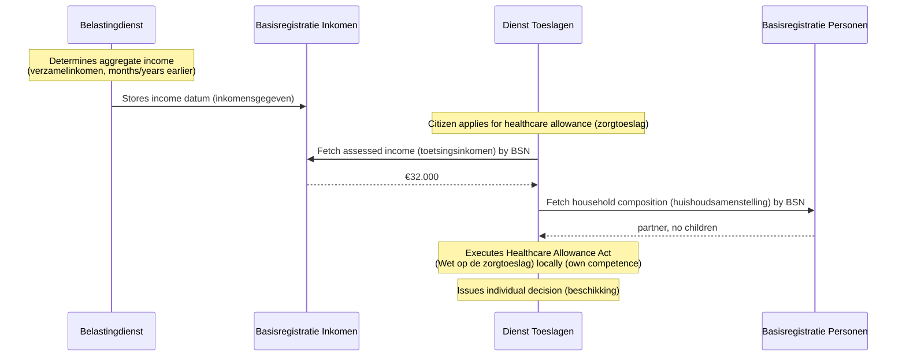
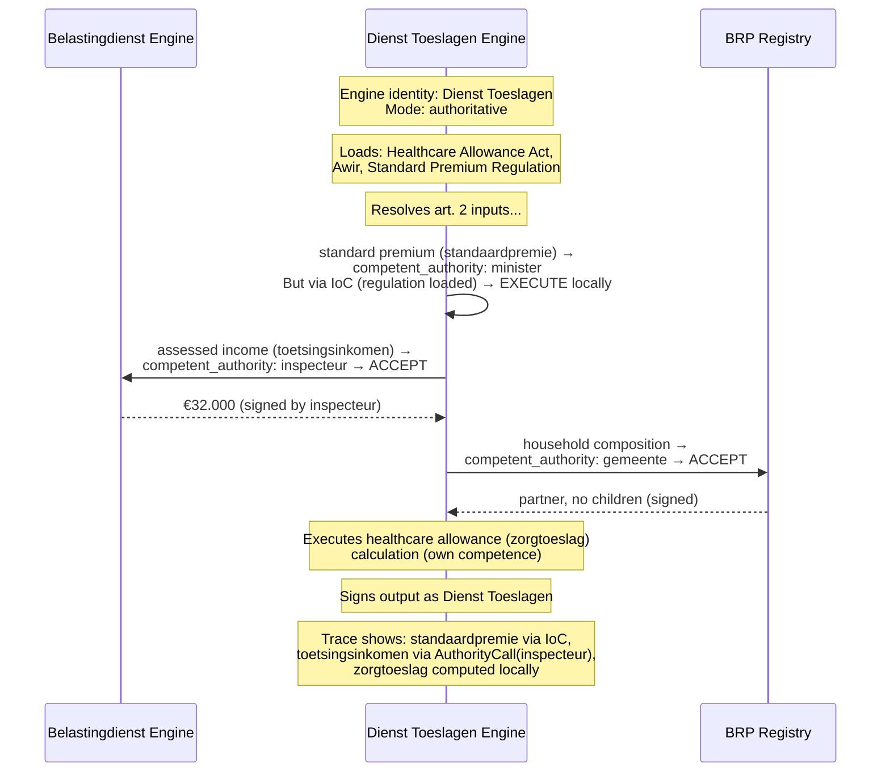
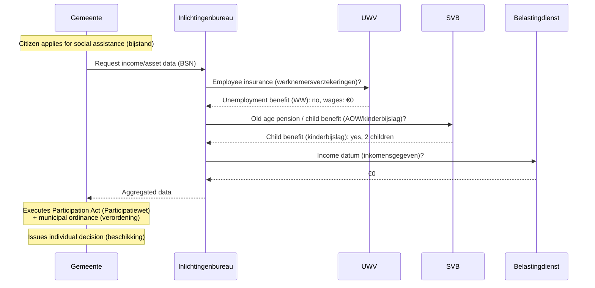
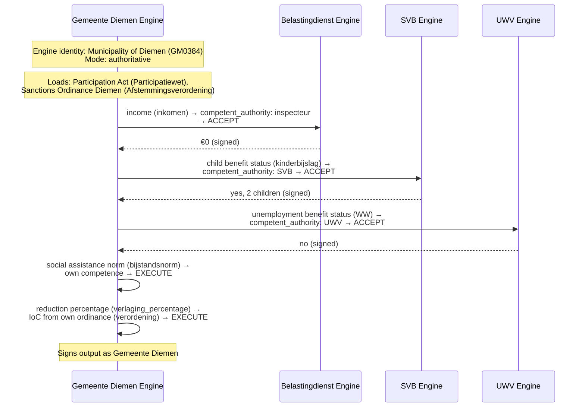
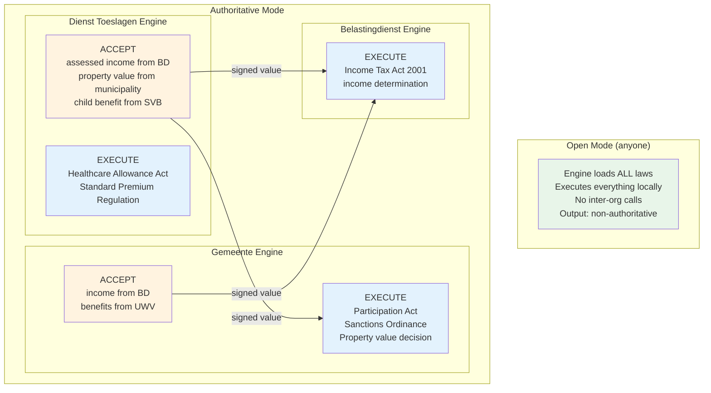

# RFC-009: Multi-Organisation Execution

**Status:** Proposed
**Date:** 2026-03-22
**Authors:** Eelco Hotting

## Context

Prior to this RFC, the engine has no concept of organisational boundaries at execution time — it loads all laws and executes everything in-process. RFC-010 (Federated Corpus) addresses *where laws come from* but not *who executes what*.

In reality, Dutch law assigns specific computations to specific organisations. The Healthcare Allowance Act (*Wet op de zorgtoeslag*) assigns execution to Allowances Service (*Dienst Toeslagen*). The Participation Act (*Participatiewet*) assigns execution to the municipality (*gemeente*). The tax inspector (*inspecteur*) alone determines the assessed income (*toetsingsinkomen*). When one law references another law's output, the question is: does the executing organisation compute that value itself, or does it accept another organisation's individual decision (*beschikking*)?

### The legal key: individual decisions (*beschikkingen*) vs calculations (*berekeningen*)

The General Administrative Law Act (*AWB*) art. 1:3 defines a **decision** (*besluit*) as a written decision by an administrative body (*bestuursorgaan*) containing a public-law legal act. An **individual decision** (*beschikking*) is a decision that is not of general scope — directed at a specific person or case. Only a competent authority (*bevoegd gezag*) can issue an individual decision (*beschikking*), and other organisations are legally bound by it.

A **calculation** (*berekening*) — applying a formula, evaluating a definition, computing an intermediate value — is not a decision (*besluit*). It has no independent legal force. Anyone with the rules and data can perform it.

This distinction determines the execution boundary. The schema already captures it through two fields:

- `competent_authority` (RFC-002): which authority is competent to issue the decision
- `produces.legal_character`: whether the article's output constitutes an individual decision (`BESCHIKKING`), assessment (`TOETS`), or informational output (`INFORMATIEF`)

When an article produces a `BESCHIKKING` and declares a `competent_authority`, only that authority can produce it authoritatively. All other articles — definitions, formulas, sub-checks — can be executed by anyone.

### Problems with inter-org execution prior to this RFC

Without this RFC, organisations exchange semi-finished products through registries like the Income Registry (*Basisregistratie Inkomen*, BRI) and infrastructure like Suwinet. This model has well-documented problems:

- **Staleness**: allowances (*toeslagen*) are granted on estimated income; definitive calculations follow 1–2 years later, causing massive recovery orders (*terugvorderingen*)
- **Error propagation**: errors in one organisation's individual decision (*beschikking*) cascade to all downstream decisions (Algemene Rekenkamer, "Grip op Gegevens", 2019)
- **Opacity**: citizens cannot see or understand the chain of decisions that led to their individual decision (*beschikking*)
- **Diffuse responsibility**: when multiple organisations contribute to a decision chain, accountability is unclear (POK report "Ongekend Onrecht", 2020)
- **No verifiability**: consuming organisations receive a number but cannot verify how it was computed

### Design principles

1. **The law defines the boundaries.** The engine does not invent execution boundaries. It reads `competent_authority` from the law YAML and derives who must execute what.

2. **Identity determines behaviour.** The engine knows which organisation it represents. When it encounters a cross-law reference to an article that produces an individual decision (*beschikking*) with a different `competent_authority`, it accepts rather than executes. Articles that produce definitions or calculations are always executed locally, regardless of which regulation they belong to.

3. **Everyone can simulate.** The competent-authority boundary only applies to authoritative (*voor-recht-geldende*) execution. Anyone can run the full chain locally for analysis, policy exploration, or scenario testing. The difference is in the legal status of the output, not in the engine's capability.

4. **Transparency by default.** Every execution produces a trace showing which values were computed locally and which were accepted from other organisations, enabling end-to-end auditability across organisational boundaries.

## Decision

### 1. Two resolution modes: Execute and Accept

When the engine resolves a cross-law reference, it operates in one of two modes:

- **Execute**: load the rules, run them locally, produce the value. Used when the executing organisation is competent, or when no specific competent authority is declared (pure definitions and calculations (*berekeningen*)).

- **Accept**: take another organisation's authoritative determination as input. Used when another organisation is the declared competent authority for that output.

The mode is **not declared in the YAML**. It is derived at runtime from three things:

1. The target article's `produces.legal_character` — does this article produce an individual decision (*beschikking*)?
2. The target article's (or regulation's) `competent_authority` — who is competent for that decision?
3. The engine's own identity — am I that authority?

```
Does the target article declare produces.legal_character == BESCHIKKING?
  NO  → EXECUTE (it's a definition, calculation, or sub-check — anyone can compute)
  YES →
    Is a competent_authority declared (article-level or regulation-level)?
      NO  → EXECUTE (missing metadata, warn — should be annotated)
      YES →
        Is the competent_authority me (or my category)?
          YES → EXECUTE (I am competent)
          NO  → ACCEPT (they are competent, use their determination)
```

The `produces.legal_character` field is the primary trigger, not `competent_authority` alone. This is essential because a single regulation can contain both articles that produce individual decisions (*beschikkingen*) and articles that define terms or calculate intermediate values. For example, the Income Tax Act (*Wet inkomstenbelasting 2001*) has `competent_authority: Belastingdienst` at regulation level, but article 2.18 (aggregate income (*verzamelinkomen*)) is a pure definitional formula — anyone can compute it. Only the articles that produce the actual tax assessment (*aanslag*), which is the individual decision (*beschikking*), require the Tax Authority (*Belastingdienst*).

When an article **does** produce a `BESCHIKKING`, **all its outputs** are part of that single determination. In Dutch administrative law, the individual decision (*beschikking*) is indivisible — both the right (*recht*) and the amount (*hoogte*) are constitutive elements of one decision. You cannot accept the right from the authority but re-calculate the amount yourself.

For `CATEGORY` authorities (RFC-002), the engine resolves the category against its identity. A municipality (*gemeente*) engine with identity `GM0363` matches `competent_authority: { name: "college van burgemeester en wethouders", type: CATEGORY }`.

### 2. Engine identity

The engine receives an identity at startup:

```yaml
# engine-identity.yaml
identity:
  name: "Dienst Toeslagen"
  organisation_id: "00000004003214345000"  # OIN
  type: INSTANCE

# or for a gemeente:
identity:
  name: "Gemeente Amsterdam"
  organisation_id: "00000001002564440000"  # OIN
  gemeente_code: "GM0363"
  type: CATEGORY_MEMBER
  category: "college van burgemeester en wethouders"
```

When `type` is `CATEGORY_MEMBER`, the engine matches against any `competent_authority` with `type: CATEGORY` and the same `category` name. This resolves the RFC-002 open question of how categorical authorities work at runtime.

With a self-signed identity (the default), the engine runs in **solo simulation** — it executes everything locally, regardless of `competent_authority`.

### 3. Execution modes

The engine has two independent dimensions, selectable at startup:

**Connectivity: Solo or Federated**

- **Solo**: the engine executes everything locally. No inter-org calls. When it encounters an article with another org's `competent_authority`, it executes the rules locally anyway (simulation) or errors if it cannot (authoritative without the required dependency).
- **Federated**: the engine calls other organisations' engines via FSC when it encounters an article with another org's `competent_authority`. If the other engine is unreachable, this is an error — not a silent fallback to local execution.

**Legal status: Simulation or Authoritative**

- **Simulation**: outputs are non-authoritative and unsigned. For analysis, testing, and exploration.
- **Authoritative**: outputs are signed with the engine's identity and have legal standing. Every individual decision (*beschikking*) produced is a formal act by the competent authority (*bevoegd gezag*).

These combine into four modes:

| | **Solo** | **Federated** |
|---|---|---|
| **Simulation** | Execute everything locally, self-signed identity, unsigned outputs. For citizens, policy analysis, development. | Execute with identity, call other orgs (or demo orgs with self-signed identities), unsigned outputs. For integration testing, demo setups. |
| **Authoritative** | Execute with identity, sign outputs. No cross-org calls — only for laws fully within this org's competence. | Execute with identity, sign outputs, accept signed individual decisions (*beschikkingen*) from other orgs via FSC. Production mode. |

**Solo simulation** is the default. It is the mode used for citizen-facing scenario tools, policy analysis, and development.

**Federated authoritative** is the production mode. The engine identifies as a specific organisation, executes its own competence, accepts individual decisions (*beschikkingen*) from other competent authorities, and signs its outputs.

**Solo authoritative** is for organisations executing laws that have no cross-org dependencies — the entire computation is within their own competence. The engine signs its outputs but makes no external calls.

**Federated simulation** is for integration testing. The engine has an identity and makes real calls to other engines (which may run with fake identities in a demo setup), but outputs are not authoritative. This tests the full inter-org chain without producing legally binding results.

### 4. Service discovery: how engines find each other

In federated mode (both simulation and authoritative), the engine needs to know where to reach other organisations' engines (or registries). This RFC adopts **Federated Service Connectivity (FSC)** as the connectivity standard.

#### Why FSC

[FSC](https://gitdocumentatie.logius.nl/publicatie/fsc/core/) is an open, jurisdiction-independent standard for federated API connectivity. Originally developed by VNG (Association of Dutch Municipalities) as part of Common Ground, it is now managed by Logius and is being adopted as the national standard for government API exchange (mandatory for Digikoppeling REST API services from 2027).

FSC is not Dutch-specific. Its core concepts are generic:

| FSC concept | What it does | regelrecht use |
|---|---|---|
| **Peer** | An organisation that provides and/or consumes services | Each org running a regelrecht engine is a Peer |
| **Group** | A set of Peers that share a Trust Anchor | All regelrecht-participating orgs form a Group |
| **Directory** | Central service discovery point for a Group | Engines register their law evaluation API; consuming engines discover competent authorities (*bevoegde gezagen*) |
| **Contract** | Signed agreement between Peers defining allowed interactions | Encodes which org may request which outputs — derived from the legal basis in the law |
| **Grant** | Permission within a Contract (ServiceConnectionGrant, DelegatedServiceConnectionGrant) | Org A may connect to org B's engine |
| **Trust Anchor** | Root CA that all Peers trust | Any agreed CA for the jurisdiction |

FSC provides exactly what multi-org law execution needs:

1. **Service discovery**: organisations register their regelrecht engine endpoints in the Directory. The `competent_authority` name in the law YAML maps to a Peer in the Directory, which maps to an endpoint.
2. **Contract-based connectivity**: Peers negotiate Contracts with Grants to establish that they may call each other's services. Authentication as a verified government org is sufficient basis for a Grant.
3. **Mutual authentication**: x.509 certificates signed by the Group's Trust Anchor, mTLS on all connections.
4. **Audit trail**: contract signatures and connection logging provide a verifiable record of inter-org interactions.

Because FSC is jurisdiction-independent, the same multi-org execution model works outside the Netherlands. A Belgian or German jurisdiction could form its own FSC Group with its own Trust Anchor, or join a cross-border Group for EU-wide law execution.

#### Development: local service registry

For development, testing, and the working demo, a local `service-registry.yaml` stands in for the FSC Directory:

```yaml
# service-registry.yaml (development stand-in for FSC Directory)
services:
  - authority: "Dienst Toeslagen"
    type: INSTANCE
    endpoint: "http://localhost:8081/api/v1"

  - authority: "college van burgemeester en wethouders"
    type: CATEGORY
    instances:
      - gemeente_code: "GM0363"
        name: "Gemeente Amsterdam"
        endpoint: "http://localhost:8082/api/v1"
      - gemeente_code: "GM0384"
        name: "Gemeente Diemen"
        endpoint: "http://localhost:8083/api/v1"

  - authority: "inspecteur"
    type: INSTANCE
    endpoint: "http://localhost:8084/api/v1"
```

The consuming engine doesn't know or care whether the providing endpoint runs a live regelrecht engine or serves pre-computed individual decisions (*beschikkingen*) from a registry. That's the providing org's implementation choice. Both respond to the same protocol (§5).

### 5. Inter-engine protocol

When an engine in authoritative mode needs to accept a value, it calls the competent organisation's endpoint:

**Request:**
```json
{
  "law_id": "wet_op_de_zorgtoeslag",
  "article": "2",
  "output": "toetsingsinkomen",
  "parameters": {
    "bsn": "999990019",
    "berekeningsjaar": 2025
  },
  "reference_date": "2025-01-01",
  "requesting_identity": {
    "name": "Dienst Toeslagen",
    "organisation_id": "00000004003214345000"
  }
}
```

**Response:**
```json
{
  "value": 32000,
  "type": "currency",
  "authority": {
    "name": "inspecteur",
    "organisation_id": "00000001003214345001"
  },
  "provenance": {
    "law_id": "wet_inkomstenbelasting_2001",
    "article": "2.18",
    "law_version": "abc123def",
    "computed_at": "2025-06-15T10:30:00Z",
    "mode": "authoritative"
  },
  "signature": "eyJ..."
}
```

The response includes:
- The value and its type
- The authority that produced it
- Provenance: which law version, when computed, in which mode
- A signature: cryptographic proof that the competent authority produced this value

The **signature** is what makes the output authoritative. In simulation mode, the engine produces unsigned outputs. In authoritative mode, outputs are signed with the engine's identity. A consuming engine can verify that an accepted value was indeed signed by the competent authority.

### 6. Authentication and connectivity

**Authentication** is handled through FSC. FSC uses x.509 certificates signed by the Group's Trust Anchor. All connections between Peers use mutual TLS (mTLS). Each jurisdiction chooses its own Trust Anchor and certificate infrastructure.

A regelrecht engine in production:
1. Has a certificate signed by the Group's Trust Anchor
2. Registers its law evaluation API in the FSC Directory
3. Establishes FSC Contracts with organisations it needs to call (and that need to call it)
4. Uses mTLS on all inter-engine communication

For development: self-signed certificates and the local `service-registry.yaml` replace the FSC Directory.

**Connectivity**: FSC Contracts with Grants establish which organisations may connect to each other's engines. Authentication as a verified government organisation is sufficient basis for a Grant — FSC handles the "can org A talk to org B" question.

**Request-level authorization** — whether org A may request specific data about a specific citizen — is a separate concern that operates at a different layer. This is out of scope for this RFC and will be addressed in a future RFC.

**Event-driven re-evaluation**: when upstream individual decisions (*beschikkingen*) change (e.g., the tax inspector (*inspecteur*) corrects an assessed income (*toetsingsinkomen*)), the providing engine can notify consuming engines. This triggers re-evaluation of downstream individual decisions (*beschikkingen*) — addressing the staleness problem in the current semi-finished products model. The notification mechanism is out of scope for this RFC but FSC's contract model supports it.

### 7. Impact on current collaboration chains

#### Without regelrecht: healthcare allowance (*zorgtoeslag*)



#### With regelrecht: healthcare allowance (*zorgtoeslag*)



**What changes:**
- The intermediate BRI registry step is replaced by a direct engine-to-engine call (or engine-to-registry call — the Belastingdienst chooses its implementation)
- The assessed income (*toetsingsinkomen*) comes with provenance: which law version, when computed
- Allowances Service (*Dienst Toeslagen*) can *verify* the accepted value by running the Income Tax Act (*Wet IB*) rules in solo simulation
- The citizen sees a complete trace: "your healthcare allowance (*zorgtoeslag*) was computed by Allowances Service (*Dienst Toeslagen*) using assessed income (*toetsingsinkomen*) €32.000 as determined by the tax inspector (*inspecteur*) on [date]"

#### Without regelrecht: Participation Act (*Participatiewet*) — social assistance (*bijstand*)



#### With regelrecht: Participation Act (*Participatiewet*) — social assistance (*bijstand*)



**What changes:**
- Competent authorities communicate peer-to-peer — the engine resolves cross-org references directly based on `competent_authority`
- Each accepted value comes with provenance and signature
- The municipality (*gemeente*) can verify any accepted value by switching to solo simulation

#### The big picture



### 8. Trace model

#### Traces stay with the executing org

Each organisation's engine produces its own trace for the computation it performs. Traces are **not shared** between organisations. When engine A accepts a value from engine B, engine A's trace records the accepted value and a reference — not engine B's internal computation. This is privacy by design: engine B's trace may contain data about the citizen that engine A has no legal basis to see.

This principle aligns with the [Logboek Dataverwerkingen](https://logius-standaarden.github.io/logboek-dataverwerkingen/) standard: each organisation logs its own data processing, logs are not exchanged between organisations, and the citizen can request their logs from each org independently.

#### How cross-org boundaries appear in traces

The existing trace uses `PathNodeType` to identify what each trace node represents. Cross-law calls use `UriCall`, IoC resolution uses `OpenTermResolution`. For cross-org boundaries, a new node type is introduced:

- **`AuthorityCall`** — the engine needs a value that is another organisation's competence (*bevoegdheid*)

This follows the same parent-child pattern as `UriCall` and `OpenTermResolution`: the parent node explains what is happening, the child node holds the result.

**Example: healthcare allowance (*zorgtoeslag*) trace in federated authoritative mode**

```
Article wet_op_de_zorgtoeslag#2
├── Resolve standaardpremie
│   └── OpenTermResolution standaardpremie
│       └── Article regeling_standaardpremie#1
│           └── standaardpremie = €1.928
├── AuthorityCall toetsingsinkomen
│   ├── message: "competence of inspecteur — not this engine"
│   └── Resolve toetsingsinkomen
│       ├── authority: inspecteur
│       ├── value: €32.000
│       ├── signed: true
│       └── trace_id: "4bf92f3577b34da6a3ce929d0e0e4736"
├── Resolve huishoudsamenstelling
│   └── ... (from BRP, competent_authority: gemeente)
└── Operation hoogte_zorgtoeslag
    └── hoogte_zorgtoeslag = €1.234
```

The `AuthorityCall` node:
- Has a message explaining **why** this is not computed locally (it's another org's competence)
- Has a child `Resolve` node with the result, the authority that produced it, the signature status, and a **reference** identifier

The **reference** is a `trace_id` following the [W3C Trace Context](https://www.w3.org/TR/trace-context/) standard, as prescribed by the Logboek Dataverwerkingen standard. When engine A calls engine B via FSC, the `trace_id` propagates across the organisational boundary. Both orgs log their side of the interaction using the same `trace_id`, but neither shares its log entries with the other.

The providing org does not share its trace — it stores it in its own Logboek Dataverwerkingen.

#### Citizen access to traces

The citizen (interested party (*belanghebbende*)) can request their trace from each organisation that contributed to their decision, using their right of access (*inzagerecht*, AVG art. 15):

1. From Allowances Service (*Dienst Toeslagen*): the full healthcare allowance (*zorgtoeslag*) trace, including the `AuthorityCall` nodes with `trace_id` references
2. From the Tax Authority (*Belastingdienst*): the log entries for the same `trace_id`, showing how the assessed income (*toetsingsinkomen*) was determined

Each org authenticates the citizen independently and provides only the trace for that citizen's computation. A citizen portal could aggregate these by following `trace_id` references across orgs, presenting a complete cross-org chain without any org needing to share traces with another org.

#### Solo simulation traces

In solo simulation, the engine executes everything locally but marks cross-org boundaries:

```
Article wet_op_de_zorgtoeslag#2
├── ...
├── AuthorityCall toetsingsinkomen (simulated)
│   ├── message: "competence of inspecteur — simulated locally"
│   └── Article wet_inkomstenbelasting_2001#2.18
│       └── ... (full local computation)
└── ...
```

The `AuthorityCall` node is still present (so org boundaries are visible) but instead of an accepted value, it contains the full local computation subtree, marked as simulated.

### 9. Simulation modes

In **solo simulation** (the default), the engine ignores `competent_authority` entirely. It loads all laws and executes everything locally. This is:

- **The default** — nothing changes for existing users
- **The citizen's view** — a citizen running the engine in their browser (WASM) can explore the entire chain: "what if my income were X, what would my healthcare allowance (*zorgtoeslag*) be?" They execute everything including the assessed income (*toetsingsinkomen*) calculation. The output is non-authoritative but fully transparent. A future extension (out of scope for this RFC) could allow the engine to fetch the citizen's real data from organisations on behalf of the citizen, using the citizen's own identity.
- **Policy analysis** — a policy maker can change a rule and see the downstream effects across the entire chain, regardless of organisational boundaries.

In **federated simulation**, the engine has an identity and makes real calls to other engines via FSC, but outputs are non-authoritative. This is for integration testing: the full inter-org chain is exercised, including service discovery, authentication, and the inter-engine protocol. If a called engine is unreachable, this is an error — not a silent fallback to local execution. Demo setups use self-signed identities.

### Note: data layer and legal basis for inter-org data exchange

This RFC addresses which organisation **executes** which rules and how organisations exchange **individual decisions** (*beschikkingen*). It does not address the underlying **data layer**: how organisations obtain the raw input data they need to execute those rules.

In Dutch law, there is no general legal basis for one government organisation to request data from another. Each inter-organisational data exchange requires its own specific legal basis — either through a base registry (*basisregistratie*) with mandatory use provisions (*verplicht gebruik*) in its own law, a domain-specific law (e.g., Wet SUWI art. 62 for the work and income domain, Participation Act (*Participatiewet*) art. 64 for social assistance), or a bilateral statutory provision.

The policy principle of "single request, multiple use" (*eenmalige uitvraag, meervoudig gebruik*) aspires to prevent citizens from having to provide the same data to multiple government organisations. For data in base registries (*basisregistraties*), this is legally enforced through per-registry mandatory use provisions. For data outside the base registries, it remains a policy aspiration without a general legal mechanism. There is no general statutory obligation for one government organisation to share data with another.

Machine-readable law partially mitigates this: when org B can load org A's published rules and execute them locally using data org B already legitimately holds, the need for inter-org data exchange is reduced. But it does not eliminate it — there remain cases where org B needs data that only org A has, and no registry or specific law covers the exchange.

The data layer — how engines obtain input data, which registries they connect to, what legal basis each data flow requires, and how this interacts with the execute/accept model — is out of scope for this RFC and will be addressed in a future RFC.

## Why

### Benefits

- **Derived from law, not configured.** The execute/accept boundary comes from `competent_authority` in the law YAML, not from per-reference configuration. Adding a new law doesn't require configuring execution boundaries.

- **Backward compatible.** Solo simulation is the default. Existing users, tests, and deployments are unaffected.

- **Transparent.** Every execution trace shows which values were computed locally (execute) and which were accepted from other organisations, with full provenance. This directly addresses the opacity problem identified by the Court of Audit (*Algemene Rekenkamer*) and the Parliamentary Committee (*POK*).

- **Verifiable.** Because all laws are published as machine-readable YAML, any organisation can verify an accepted value by switching to solo simulation and re-executing locally. This satisfies the General Administrative Law Act (*AWB*) art. 3:9 duty to verify (*vergewisplicht*).

- **Legally grounded.** The execute/accept distinction maps directly to individual decision (*beschikking*) vs calculation (*berekening*) in Dutch administrative law, using `produces.legal_character` and `competent_authority` — both already in the schema. The engine doesn't invent boundaries — it reads them from the law.

- **Privacy by design.** In authoritative mode, data only flows where the law says it should. Accepted values are individual outputs (assessed income (*toetsingsinkomen*): €32.000), not bulk data. The engine sends only the parameters declared in the target article's `execution.parameters`.

### Tradeoffs

- **Requires `competent_authority` to be declared.** Laws without `competent_authority` on their articles default to "anyone can execute" — which is correct for most definitions and calculations (*berekeningen*), but means the quality of the execute/accept boundary depends on the completeness of authority annotations.

- **Inter-org latency.** Federated mode introduces network calls where solo mode has none. Critical-path accepted values add latency. Mitigation: caching with TTL based on the providing org's update frequency.

- **Requires FSC infrastructure.** Organisations need certificates from the Group's Trust Anchor and must onboard to the FSC Directory. The overhead per participating org is low (certificate + registration), but establishing the Group and Trust Anchor is a one-time coordination effort.

- **Trust model.** An accepted value is trusted because it's signed by the competent authority. If the signing key is compromised, the trust model breaks. Mitigation: standard x.509 certificate revocation via the Trust Anchor.

### Alternatives Considered

**Alternative 1: Mode declared per source reference in YAML**
- Each `source` reference would declare `mode: execute` or `mode: accept`
- Rejected: this duplicates what `competent_authority` already expresses. The YAML would need to encode the same information in two places, creating inconsistency risk. The law doesn't say "fetch this value" — it says "this is determined by [org]." The engine should derive the mode, not have it configured.

**Alternative 2: Centralised execution (one engine runs everything)**
- A single national engine loads all laws and executes everything, returning results to individual organisations
- Rejected: violates execution sovereignty. A municipality (*gemeente*) should be able to run its own engine with its own ordinance (*verordening*). Also creates a single point of failure and a massive data concentration.

**Alternative 3: Full delegation (call another org's engine for any cross-law reference)**
- Every cross-law `source.regulation` triggers a remote call to the org that authored the referenced law
- Rejected: most cross-law references are definitional references (*begripsverwijzingen*) or IoC delegations. Delegating these would mean calling the national government (*Rijksoverheid*) engine for every law that defines a term. The legal reality is that anyone can apply a definition — delegation is only needed for individual decisions (*beschikkingen*).

### Implementation Notes

#### Phase 1: Engine identity and mode selection
- Add `EngineIdentity` struct with `name`, `organisation_id`, `type`, optional `gemeente_code`
- Add `Connectivity` enum: `Solo`, `Federated`
- Add `LegalStatus` enum: `Simulation`, `Authoritative`
- Configure via CLI flag or config file
- In `SoloSimulation` mode: default behaviour, no changes

#### Phase 2: Execute/Accept resolution
- In `resolve_external_input_internal()`: before executing the target article, check `competent_authority`
- If `Authoritative` mode and competent authority ≠ engine identity → route to Accept path
- If `Simulation` → always execute locally (solo) or execute locally and annotate trace (federated)
- If `Federated` + `Simulation` → make real calls to other engines but mark outputs as non-authoritative
- If `Solo` + `Authoritative` → error if cross-org dependency is encountered that cannot be resolved locally

#### Phase 3: Service discovery and inter-engine protocol
- Parse `service-registry.yaml` (development stand-in for FSC Directory)
- Implement HTTP client for the inter-engine protocol
- Request/response types matching §5 above
- Signature generation and verification (dev-mode: self-signed keys; production: Trust Anchor certificates)
- OpenAPI specification for the law evaluation endpoint

#### Phase 4: Trace model
- Add `PathNodeType::AuthorityCall` for cross-org boundary nodes
- Add `authority`, `signed`, `trace_id` fields to `PathNode` (optional, used only for `AuthorityCall` children)
- Propagate W3C Trace Context (`trace_id`, `span_id`) across inter-engine calls, aligning with the existing OpenTelemetry instrumentation and the Logboek Dataverwerkingen standard
- In solo simulation: `AuthorityCall` wraps a local computation subtree instead of an accepted value

#### Affected components

| File | Change |
|------|--------|
| `packages/engine/src/service.rs` | `EngineIdentity`, `ExecutionMode`, accept routing in `resolve_external_input_internal()` |
| `packages/engine/src/resolver.rs` | No change (already resolves laws by id) |
| `packages/engine/src/trace.rs` | `authority`, `signed`, `reference` fields on `PathNode` |
| `packages/engine/src/types.rs` | `PathNodeType::AuthorityCall` variant |
| `packages/engine/src/priority.rs` | No change |
| New: `packages/engine/src/identity.rs` | `EngineIdentity`, `matches_authority()`, identity matching logic |
| New: `packages/engine/src/federation.rs` | `ServiceRegistry`, `InterEngineClient`, request/response types |
| New: `packages/engine/src/signature.rs` | Output signing and verification |
| Schema: `schema/v0.5.0/schema.json` | No schema change needed — `competent_authority` already exists |

## References

- RFC-002: Authority (*Bevoegdheid*) — defines `competent_authority` at article level
- RFC-003: Inversion of Control — `open_terms` + `implements` for delegation (unchanged, always execute locally)
- RFC-007: Cross-Law Execution — hooks and overrides (fire locally, require relevant laws to be loaded)
- RFC-010: Federated Corpus — rule distribution (how engines obtain laws from multiple sources)
- Court of Audit (*Algemene Rekenkamer*), "Grip op Gegevens" (2019) — problems with inter-org data exchange
- Parliamentary Committee (*POK*) Report "Unprecedented Injustice" (*Ongekend Onrecht*) (2020) — chain-of-automation failures
- SyRI ruling (ECLI:NL:RBDHA:2020:865) — transparency and proportionality requirements
- State of Government Implementation (*Staat van de Uitvoering*) (2022, 2024) — semi-finished products problems
- [Federated Service Connectivity (FSC) Core specification](https://gitdocumentatie.logius.nl/publicatie/fsc/core/) — service discovery, contract-based connectivity, and mTLS authentication
- [Logboek Dataverwerkingen](https://logius-standaarden.github.io/logboek-dataverwerkingen/) — each org logs its own data processing; logs are not exchanged between orgs; citizen can request their logs from each org
- [W3C Trace Context](https://www.w3.org/TR/trace-context/) — standard for propagating trace identifiers across service boundaries
- [Glossary of Dutch Legal Terms](../glossary.md)
