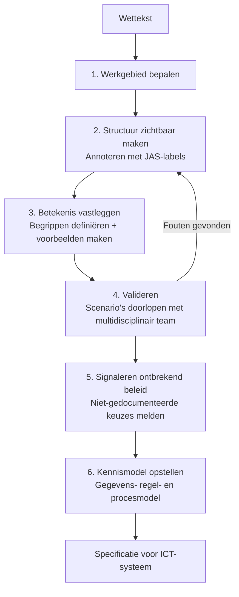
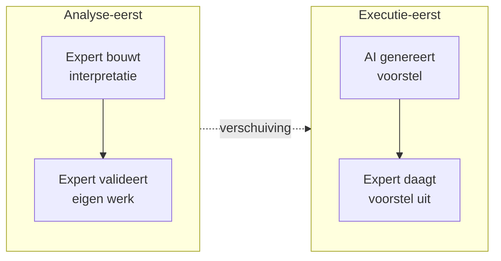
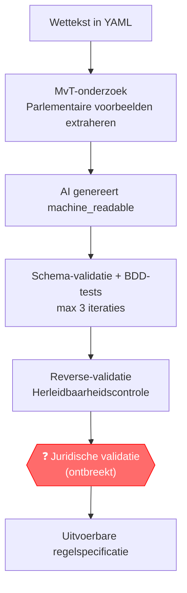
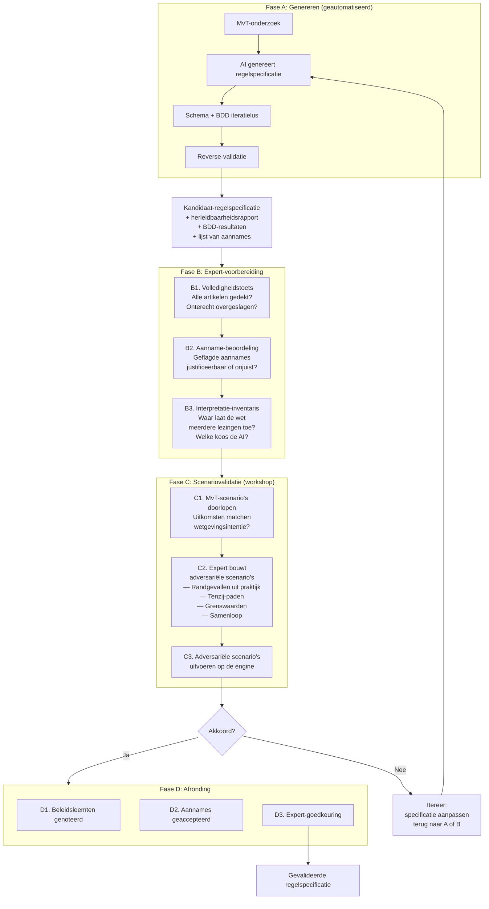
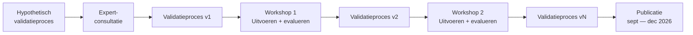

# RegelRecht Validatie: Van Analyse-Eerst naar Executie-Eerst

## Probleembeschrijving

De opgave om van wet naar digitale werking te komen is weerbarstig: al jaren lang wordt er verzuild en versnipperd gewerkt aan methoden, frameworks en talen om invulling te geven aan het formaliseren van regelspecificaties.

Dit document schetst de rode draad in 15 jaar ontwikkeling, identificeert de fundamentele verschuiving die RegelRecht maakt, en stelt een validatiemethode voor die past bij die nieuwe werkwijze.

## Bestaande methoden: een analyse-eerst traditie

### Wetsanalyse

Wetsanalyse is een juridische analysemethode ontwikkeld vanuit de praktijk bij uitvoeringsorganisaties (Belastingdienst, UWV, DUO). De methode is gecodificeerd in het boek *Wetsanalyse* (Ausems, Bulles & Lokin, 2021) en wordt onderhouden door Lokin (Hooghiemstra & Partners) en Gort (ICTU).

De kern van Wetsanalyse is het **Juridisch Analyseschema (JAS)**: een classificatiesysteem van 13 elementtypen waarmee iedere formulering in wetgeving wordt gelabeld — van rechtssubject en rechtsbetrekking tot afleidingsregel en voorwaarde.

Het proces bestaat uit zes stappen:

Drie kenmerken zijn bepalend:

1. **Mensen doen alles** — annotatie, definitie, modellering en validatie worden door mensen uitgevoerd
2. **Validatie toetst eigen werk** — het multidisciplinaire team controleert de modellen die het zelf heeft gebouwd
3. **Herleidbaarheid is ingebouwd** — elk element in het kennismodel verwijst terug naar de bronformulering in de wet

De uitkomst is een kennismodel bestaande uit een gegevensmodel (FBM/ER), regelmodel (DMN-beslistabellen) en procesmodel (BPMN). Dit model vormt de basis voor de bouw van een ICT-systeem.

### Gemene deler in bestaande methoden

Ondanks verschillen in terminologie volgen de bestaande methoden hetzelfde basispatroon:

1. **Decompositie** — de wettekst ontleden in beheersbare eenheden
2. **Identificatie** — kernconcepten herkennen (wie, wat, wanneer, welk gevolg)
3. **Interpretatie** — expliciet vastleggen wat de wet betekent
4. **Modellering** — ordenen in gegevens-, regel- en procesmodellen
5. **Validatie** — toetsen aan concrete scenario's en testgevallen
6. **Herleidbaarheid** — elke regel terug kunnen herleiden naar de bron

Al deze methoden zijn *analyse-eerst*-benaderingen: ze beginnen bij de wet en werken toe naar een model of regelset. De vertaalslag wordt volledig door mensen gemaakt.

## RegelRecht: een executie-ecosysteem

RegelRecht is niet enkel een methode of een DSL maar een breed executie-ecosysteem voor het machine-uitvoerbaar maken van wetten. Drie principes onderscheiden het van de analyse-eerst traditie.

### Principe 1: Execution-first

Waar bestaande methoden een analyse-eerst benadering delen, heeft RegelRecht ten doel om tot een samenhangend stelsel van machine-uitvoerbare wetgeving te komen. Wetten interacteren grensoverstijgend met elkaar en burgers hebben geen last van complexiteit.

De regelspecificatie krijgt een *single source of truth*-status voor de werking van de wet. Het is niet een analyselaag die leidt tot een vertaling — de uitkomst van de analyse **is** de wet in uitvoerbare werking.

### Principe 2: Transparant en simpel

Het execution-first uitgangspunt vereist dat werkwijzen en methoden transparant zijn: niet alleen open source, maar ook begrijpelijk voor experts uit verschillende disciplines wanneer zij samen tot een beslissing moeten komen over de werking van wetten.

De kern van het schema voor regelspecificaties bestaat uit eenvoudige logische operatoren die controleerbaar zijn door mensen. Geen vendor lock-in, geen convoluut van schema's.

### Principe 3: Schaalbaarheid in analyse

Bestaande methoden hebben de fundamenten gelegd voor het omgaan met de juridische werkelijkheid bij het komen tot machine-uitvoerbaarheid. Dat is een inherent interdisciplinair en intensief proces.

Binnen het RegelRecht-ecosysteem wordt gewerkt met Generatieve AI als fundament: AI genereert voorstellen voor regelspecificaties waarlangs de analyse (of validatie) wordt uitgevoerd. Dit brengt potentiële kansen met zich mee voor de snelheid en schaal van het uitvoerbaar maken van wetten.

## De verschuiving: van bouwen naar uitdagen

De inzet van AI verandert de rol van de juridisch expert fundamenteel:

| | Analyse-eerst | Executie-eerst |
|---|---|---|
| Wie creëert? | Mens | AI |
| Wie valideert? | Zelfde team | Juridisch expert |
| Cognitieve taak | Bouwen + controleren | Uitdagen + beoordelen |
| Herleidbaarheid | Ingebouwd bij creatie | Achteraf gecontroleerd |
| Interpretatiekeuzen | Expliciet gedocumenteerd | Impliciet in AI-output |
| Schaal | Beperkt door menselijke capaciteit | Beperkt door validatiecapaciteit |

Dit is de kern van de verschuiving: de bottleneck verplaatst zich van *creatie* naar *validatie*. Dat maakt een robuuste validatiemethode de kritische schakel in het ecosysteem.

### Risico's van de verschuiving

De verschuiving brengt specifieke risico's met zich mee die niet spelen bij analyse-eerst:

- **Automation bias** — de neiging om AI-output als correct aan te nemen
- **Anchoring** — het voorstel van de AI beïnvloedt het oordeel van de expert
- **Blinde vlekken** — de AI weet niet wat ze niet weet; een reviewer ook niet als die niet actief zoekt
- **Impliciete interpretatiekeuzen** — waar de wet ambigu is maakt de AI een keuze zonder die te documenteren

## Probleemidentificatie: de ontbrekende schakel

Het huidige RegelRecht-ecosysteem heeft al een geautomatiseerde pipeline:

De geautomatiseerde stappen dekken:
- **Structurele correctheid** — schema-validatie
- **Gedragscorrectheid** — BDD-tests op basis van MvT-voorbeelden
- **Herleidbaarheid** — reverse-validatie controleert of elk element naar de wettekst wijst

Wat ontbreekt is een **gestructureerd proces waarmee juridisch experts de AI-voorstellen systematisch kunnen beoordelen**. Dit is niet hetzelfde als de Wetsanalyse-validatiestap (stap 4), want:

1. De expert heeft het voorstel niet zelf gebouwd — het mentale model ontbreekt
2. De AI documenteert geen interpretatiekeuzen — die moeten achterhaald worden
3. De schaal vereist een efficiënt proces — niet elke wet kan weken kosten

## Voorstel: validatiemethode in drie fasen

### Fase A: Genereren (geautomatiseerd, bestaand)

Dit is de huidige pipeline. De AI genereert een kandidaat-regelspecificatie en de geautomatiseerde controles filteren structurele fouten en onherleidbare elementen. De output is niet een "klaar" product maar een *voorstel met bijsluiter*:

- **Herleidbaarheidsrapport** — welke elementen zijn gegrond in de wettekst, welke zijn aannames
- **BDD-resultaten** — welke MvT-scenario's slagen en falen
- **Lijst van aannames** — elementen die niet direct uit de tekst volgen maar nodig zijn voor executie

### Fase B: Expert-voorbereiding

De expert beoordeelt het voorstel *voordat* er scenario's worden doorlopen. Dit is de fase die ontbreekt in de huidige pipeline en die leunt op inzichten uit Wetsanalyse:

**B1. Volledigheidstoets** — Zijn alle artikelen gedekt? Heeft de AI artikelen overgeslagen die wel uitvoerbare logica bevatten? Dit is analoog aan de scope-stap (stap 1) van Wetsanalyse, maar achteraf: niet "wat gaan we analyseren" maar "is alles geanalyseerd".

**B2. Aanname-beoordeling** — De reverse-validatie heeft aannames gemarkeerd. De expert beoordeelt per aanname: is dit een verdedigbare keuze, of moet dit anders? Dit adresseert het risico van impliciete interpretatiekeuzen.

**B3. Interpretatie-inventaris** — Waar laat de wet meerdere lezingen toe? Welke lezing heeft de AI gekozen? Is die verdedigbaar? Dit is analoog aan de betekenis-stap (stap 3) van Wetsanalyse, maar reactief: niet "wat betekent dit" maar "klopt wat de AI denkt dat dit betekent". Deze stap is cruciaal om automation bias tegen te gaan.

### Fase C: Scenariovalidatie (workshop)

De expert valideert de *werking* van de specificatie, niet de YAML zelf. Dit is het hart van de methode:

**C1. MvT-scenario's doorlopen** — De engine voert scenario's uit die afkomstig zijn uit parlementaire documenten. De expert beoordeelt of de uitkomsten overeenkomen met de wetgevingsintentie.

**C2. Adversariële scenario's bouwen** — Dit is waar de expert onvervangbaar is. De AI kent geen jurisprudentie, geen uitvoeringspraktijk, geen politieke context. De expert bouwt scenario's die de specificatie op de proef stellen:
- Randgevallen uit de praktijk en jurisprudentie
- Uitzonderingspaden ("tenzij"-clausules)
- Grenswaarden (net boven/onder drempels)
- Samenloopsituaties (interactie tussen wetten)

**C3. Adversariële scenario's uitvoeren** — De engine draait de scenario's. De expert beoordeelt de uitkomsten. Fouten leiden tot iteratie.

### Fase D: Afronding

Analoog aan de beleidsleemte-stap (stap 5) van Wetsanalyse:

- **Beleidsleemten** worden genoteerd — waar de wet onvoldoende specificeert en een keuze is gemaakt
- **Aannames** worden formeel geaccepteerd of afgewezen
- **Expert-goedkeuring** wordt vastgelegd

## Ontwerpprincipes van de methode

### De expert leest geen YAML

De expert beoordeelt *rapporten* en *uitkomsten*, niet de specificatie zelf. De geautomatiseerde pipeline levert:
- Een herleidbaarheidsrapport in leesbare vorm
- Scenario-uitkomsten met verwijzing naar wetsartikelen
- Een lijst van aannames en interpretatiekeuzen

### Validatie is uitdagen, niet bouwen

Het verschil met Wetsanalyse-validatie is fundamenteel: de expert heeft het voorstel niet gebouwd en moet actief zoeken naar fouten. De methode structureert dat zoeken door expliciet te vragen om adversariële scenario's.

### MvT-voorbeelden zijn grondwaarheid

Rekenvoorbeelden uit de Memorie van Toelichting zijn de intentie van de wetgever. Als de engine een ander resultaat geeft dan het MvT-voorbeeld, is de specificatie fout — niet het voorbeeld.

### De methode is iteratief

De methode zelf wordt ontwikkeld via een Design Science Research-aanpak:
1. Ontwerp een hypothetisch validatieproces op basis van inzichten uit Wetsanalyse en Human-GenAI interactie
2. Leg het voor aan experts uit het regeldomein
3. Voer het proces uit in workshops met praktijkcasussen
4. Evalueer en itereer de methode
5. Publiceer bevindingen

## Vergelijking met Wetsanalyse

| Wetsanalyse-stap | RegelRecht-equivalent | Verschil |
|---|---|---|
| 1. Werkgebied bepalen | Fase A: wet selecteren | Gelijk |
| 2. Structuur annotatie (JAS) | AI genereert machine_readable | Mens → AI |
| 3. Betekenis vastleggen | B3: Interpretatie-inventaris | Proactief → reactief |
| 4. Valideren met scenario's | C1–C3: Scenariovalidatie | Eigen werk → andermans voorstel |
| 5. Beleidsleemten signaleren | D1: Beleidsleemten noteren | Gelijk |
| 6. Kennismodel opstellen | Fase A: machine_readable YAML | Mens → AI |

De methode behoudt de discipline van Wetsanalyse (herleidbaarheid, scenario's, beleidsleemten) maar past de uitvoering aan op de realiteit dat de expert *beoordeelt* in plaats van *bouwt*.

## Aanpak en planning

- **Consultatie** van experts uit het regeldomein (Wetsanalyse) voor het ontwerp van de validatiemethode
- **Workshops** waarin het proces wordt uitgevoerd op praktijkcasussen en geëvalueerd
- **Iteratie** van de methode op basis van bevindingen (Design Science Research)
- **Publicatie** van bevindingen: september — december 2026
