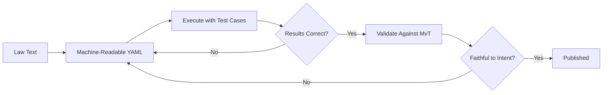

# Validation Methodology

RegelRecht uses an **execution-first** approach to validate machine-readable law interpretations.

## From Analysis-First to Execution-First

Traditional approaches analyze law text extensively before writing any code. RegelRecht inverts this:

### Why Execution-First?

1. **Fast feedback**: Errors surface immediately through execution, not after lengthy analysis
2. **Concrete verification**: Test cases from the Memorie van Toelichting provide ground truth
3. **Iterative refinement**: Each cycle improves the interpretation based on actual results
4. **Reverse validation**: After generation, every element is checked against the source text to catch hallucinated logic

## The Three-Step Loop

### 1. Generate

Create `machine_readable` sections for law articles, defining inputs, outputs, and operations.

### 2. Validate & Test

- Schema validation ensures structural correctness
- BDD scenarios (derived from MvT examples) verify behavioral correctness
- The engine executes the law and compares outputs to expected values

### 3. Reverse Validate

Every element in the machine-readable interpretation is traced back to the original legal text. Any logic that cannot be grounded in the law is flagged as potentially hallucinated.

## Memorie van Toelichting (MvT)

The MvT is the explanatory memorandum that accompanies Dutch legislation. It contains:

- The legislature's intent and reasoning
- Concrete examples of how the law should be applied
- Edge cases the legislature considered

These examples serve as the primary test cases for machine-readable interpretations.
