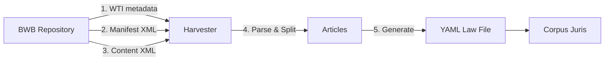

# Harvester

The harvester downloads Dutch legislation from the BWB (Basiswettenbestand) repository and converts it to the RegelRecht YAML format.

## Overview

- **Language**: Rust
- **Location**: `packages/harvester/`
- **Source**: BWB / wetten.nl (official Dutch law repository)
- **Output**: YAML law files with textual content (no `machine_readable` yet)

## How It Works



### Pipeline Steps

1. **Validate input** — BWB ID format (`BWBR` + 7 digits) and date
2. **Download WTI metadata** — title, regulatory layer, publication date
3. **Resolve consolidation date** — from manifest.xml, find version valid for target date
4. **Download content XML** — the consolidated law text (with size limit check)
5. **Parse elements** — via extensible registry of element handlers
6. **Split articles** — hierarchical splitting into artikel → lid → lijst → li with dot-notation numbering (e.g., `1`, `1.1`, `1.1.a`)
7. **Normalize text** — fix spacing, Unicode NFKD, wrap at 115 chars
8. **Generate YAML** — schema-compliant output with yamllint compliance
9. **Atomic write** — temp file → sync → rename

### Element Processing

The harvester uses an extensible **registry system** for XML element handling:

| Handler Type | Elements | Behavior |
|-------------|----------|----------|
| **Inline** | `nadruk`, `extref`, `intref`, `al` | Pass through with text |
| **Structural** | `lid`, `lidnr`, `lijst`, `li` | Manage numbering, recurse |
| **Skip** | `meta-data`, `jci`, `redactie`, `plaatje` | Excluded from output |
| **Passthrough** | `sup`, `sub` | Extract without special handling |

### Dutch Law Hierarchy

Articles are split following the legal text structure:

```
artikel (number from kop/nr)
├── lid (number from lidnr)
│   ├── al (text container)
│   └── lijst
│       └── li (number from li.nr, e.g., "a", "1°")
└── lijst (can appear directly)
    └── li
```

Produces dot-notation: `1`, `1.1`, `1.1.a`, `1.1.a.1°`

## Usage

### CLI

```bash
# Download today's version of a law
regelrecht-harvester download BWBR0018451

# Download for a specific date
regelrecht-harvester download BWBR0018451 --date 2022-03-15 --output ./laws

# Large law with increased size limit
regelrecht-harvester download BWBR0020368 --max-size 200
```

### As Library

```rust
use regelrecht_harvester::{download_law, validate_bwb_id, validate_date};

validate_bwb_id("BWBR0018451")?;
validate_date("2025-01-01")?;

let law = download_law("BWBR0018451", "2025-01-01")?;
println!("Title: {}", law.metadata.title);
println!("Articles: {}", law.articles.len());
```

## Output Path Convention

```
{output}/{regulatory_layer}/{slug}/{date}.yaml
```

Example: `regulation/nl/wet/wet_op_de_zorgtoeslag/2025-01-01.yaml`

The regulatory layer is determined from the WTI metadata (`soort-regeling` field).

## HTTP Resilience

- **Timeout**: 30 seconds (accommodates large XML files)
- **Max response size**: 100 MB (configurable via `--max-size`)
- **Retries**: 3 attempts with exponential backoff (500ms, 1s, 2s)
- **Retry triggers**: Connection errors, timeouts, 5xx responses
- **No retry on**: 4xx client errors

## Current Limitations

- **Text-only extraction** — tables and complex formatting simplified to text
- **No machine_readable** — output contains text only; executable logic added separately
- **Reference extraction incomplete** — cross-references detected but not fully resolved
- **Large laws** require `--max-size` flag (e.g., Wet op het financieel toezicht at 52.6 MB)

## Testing

```bash
just harvester-test
```

Integration tests use fixtures from `tests/fixtures/zorgtoeslag/` (real WTI and content XML) to validate the complete pipeline from XML to valid YAML.

## Further Reading

- [Law Format](/guide/law-format) — the YAML format the harvester produces
- [Pipeline](./pipeline) — job orchestration for harvesting tasks
