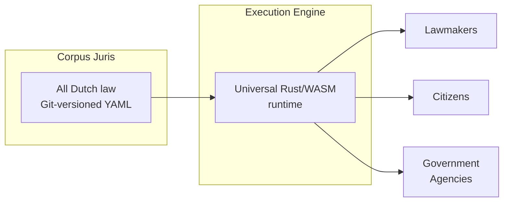

# What is RegelRecht?

RegelRecht is an open-source platform for making Dutch legislation machine-readable and executable. It enables lawmakers, government agencies, and citizens to work with law as structured, testable code.

## The Problem

Dutch law is published as natural language text. When government agencies need to implement legislation in IT systems, they manually translate legal rules into software — a process that is:

- **Error-prone**: Interpretation differences between legal experts and developers lead to incorrect implementations
- **Opaque**: Citizens cannot verify how decisions about them are made
- **Duplicated**: Every agency builds their own interpretation of the same laws
- **Untestable**: There is no way to verify that software correctly implements the law

## The Vision

RegelRecht takes a different approach: **the machine-readable specification IS the law.** Not a byproduct of analysis, not documentation of a system — the specification itself is authoritative.

A universal execution engine runs these laws deterministically. The same engine, same law, same logic — whether running:
- In the **editor** (lawmakers designing legislation)
- In the **browser** (citizens checking eligibility)
- In a **backend** (government agencies making official decisions)

### Two Pillars

1. **Corpus Juris** — A git-versioned repository containing all Dutch laws in machine-readable YAML format. Laws are organized by type and versioned by effective date.

2. **Execution Engine** — A deterministic Rust engine that evaluates laws given inputs. It compiles to both native code and WebAssembly, running identically in every context.

## Key Concepts

### Cross-Law References

Dutch laws reference each other extensively. The Wet op de zorgtoeslag references the Zorgverzekeringswet, the AWIR, and the BRP. The engine resolves these dependencies automatically — if law A depends on a value computed by law B, the engine executes both.

### Inversion of Control

Higher laws (e.g., a *wet*) can declare **open terms** that lower regulations (e.g., a *ministeriële regeling*) fill in. This mirrors the legal delegation hierarchy. Lower regulations register themselves via `implements` — just as they do in statute books with *"Gelet op artikel 4 van de Wet op de zorgtoeslag"*.

### Execution-First Validation

Rather than having humans analyze law and build specifications (analysis-first), RegelRecht uses AI to generate candidate specifications, then has legal experts **validate and challenge** them. Test scenarios are derived from the **Memorie van Toelichting** — the explanatory memorandum containing the legislature's intended examples.

### Federated Corpus

Legislation is decentralized: municipalities, provinces, and water boards produce their own regulations. The corpus supports **federated sources** — each authority maintains their own regulations in their own Git repository, while the engine discovers and loads them via a registry.

### Administrative Procedures

Individual decisions (*beschikkingen*) are not instant computations — they are administrative law processes spanning stages over time (application → review → decision → notification → objection). The AWB lifecycle is modeled as data in YAML, not hardcoded in the engine.

## Design Principles

| Principle | What It Means |
|-----------|--------------|
| **Zero domain knowledge** | The engine has no knowledge of Easter, King's Day, or public holidays. All domain knowledge comes from the law YAML. |
| **Identical execution** | Same engine, same result — browser, backend, or editor. |
| **Version control as governance** | Git history captures legislative evolution. Branches = proposals. Merges = publication. |
| **Traceability** | Every computed value traces back to a specific article and paragraph. |
| **Open by default** | All law, all tooling, all decisions — publicly auditable. |

## Next Steps

- [Getting Started](./getting-started) — set up your development environment
- [Law Format](./law-format) — understand the YAML law format
- [Architecture](/architecture/overview) — system design and components
- [RFCs](/rfcs/) — all design decisions
