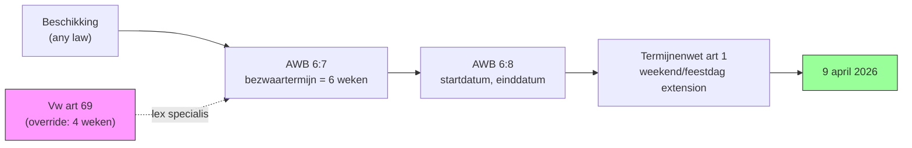
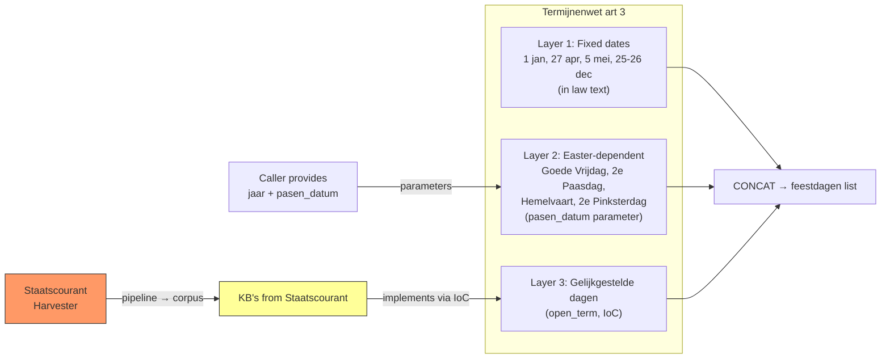
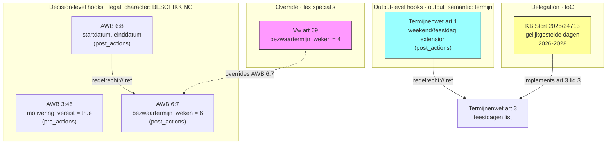
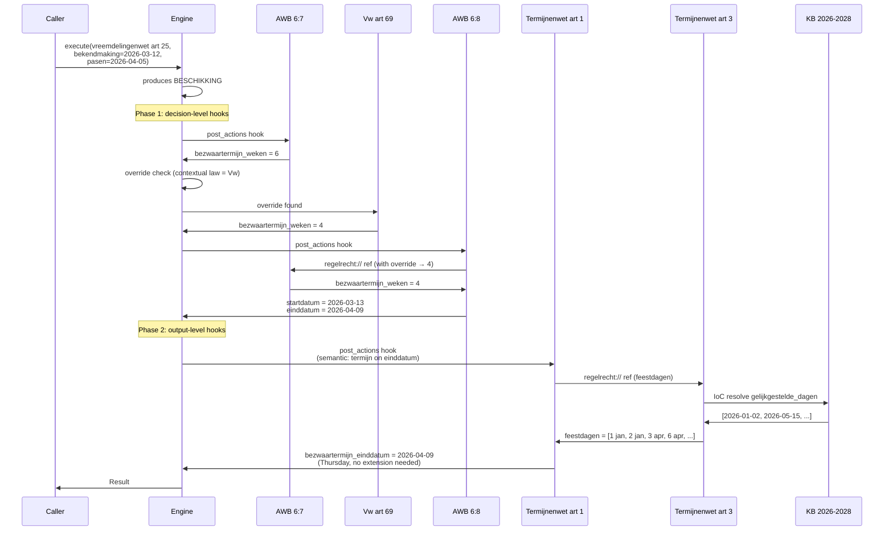

# RFC-007: Cross-Law Execution Model

**Status:** Proposed
**Date:** 2026-03-21
**Authors:** Eelco Hotting

## Context

The engine currently supports **active execution**: someone requests a legal determination, the engine evaluates with specific parameters, and produces a result. This covers laws like the Zorgtoeslagwet, Participatiewet, and BW5. But three patterns in Dutch law cannot be expressed with active execution alone:

**Reactive execution.** The Algemene wet bestuursrecht (AWB) applies whenever any government body issues an individual decision (*beschikking*). Article 6:7 sets an objection period (*bezwaartermijn*) of six weeks. Article 3:46 requires adequate reasoning (*deugdelijke motivering*). Neither article is called explicitly. They fire because the output qualifies as an individual decision (*beschikking*), regardless of which law produced it. The target law does not know about AWB. AWB does not know about the target law. The relationship is unilateral.

**Lex specialis.** AWB 6:7 says "de termijn bedraagt zes weken" — no exception clause, no delegation. Yet the Vreemdelingenwet artikel 69 says "in afwijking van artikel 6:7 bedraagt de termijn vier weken." It unilaterally replaces the value. This differs from IoC delegation (RFC-003): the general law does not know it is being overridden.

**Temporal computation.** "When is my deadline for objection (*bezwaar*)?" is not answered by "6 weeks" — it is answered by "9 april 2026." Computing that date requires a chain of four articles across three laws, using date arithmetic, public holiday calendars, and weekend rules. The engine lacks the types and operations.

These three patterns combine in the **objection period (*bezwaartermijn*) chain** — the driving example for this RFC:



### Design principle

**Zero domain knowledge in the engine.** All legal and domain knowledge comes from law YAML files and parameters. The engine provides pure operations (date arithmetic, list manipulation). It does not know about Easter, King's Day (*Koningsdag*), or public holidays (*feestdagen*) — these are all expressed in law or supplied as parameters.

### Execution modes

This RFC introduces two new execution modes alongside the existing one:

1. **Active execution**: request-response (current engine, RFC-003 IoC)
2. **Reactive execution**: hooks (this RFC)
3. **Lex specialis**: overrides (this RFC)

Two additional modes are identified but out of scope:

4. **Generative execution**: law that creates other law (git workflow)
5. **Verificative execution**: continuous invariant checking

The specification (YAML) is the same across all modes. The modes differ in triggering mechanism and required infrastructure.

## Decision

This RFC introduces three mechanisms and the types to support them.

### 1. Hooks — Reactive Execution

The engine has a defined execution lifecycle with two observable points. Laws can register hooks at these points. When a hook's filter matches the executing article's `produces` annotation, the hook fires and its outputs enrich the result.

#### Execution lifecycle

The engine evaluates an article in five stages:

1. **Create context** with parameters and calculation_date
2. **Resolve inputs** from cross-law references and data sources
3. **Resolve open terms** via IoC (RFC-003, `implements` index)
4. **Execute actions** that evaluate conditions and set outputs
5. **Return result** with outputs

#### Hook points

Two hook points interleave with this lifecycle:

| Hook point | Fires between stages | Context available to hook |
|---|---|---|
| `pre_actions` | 3 and 4 | Parameters, inputs, resolved open terms |
| `post_actions` | 4 and 5 | Parameters, inputs, open terms, outputs |

Earlier drafts included `pre_input` and `post_input` hooks. These were removed because the legal requirements that operate on the input phase tend to be application-layer concerns (authorization per AWB 2:1), authoring-time concerns (data minimization per AVG art. 5), or process-management concerns (completeness checks per AWB 4:5 with recovery period (*hersteltermijn*)). None map cleanly to a runtime engine hook.

#### YAML construct

Introduce `hooks` on article-level `machine_readable`:

```yaml
# AWB artikel 6:7
- number: '6:7'
  text: |-
    De termijn voor het indienen van een bezwaar- of
    beroepschrift bedraagt zes weken.
  machine_readable:
    hooks:
      - hook_point: post_actions
        applies_to:
          legal_character: BESCHIKKING
    execution:
      output:
        - name: bezwaartermijn_weken
          type: number
      actions:
        - output: bezwaartermijn_weken
          value: 6
```

The `hooks` block is a list. Each entry has:

- `hook_point`: one of `pre_actions`, `post_actions`
- `applies_to`: filter predicate matched against the executing article's `produces` block

Available filter fields:

| Filter field | Level | Matches against |
|---|---|---|
| `legal_character` | Decision | `execution.produces.legal_character` |
| `decision_type` | Decision | `execution.produces.decision_type` |
| `output_semantic` | Output | `output` declaration (see §3 Temporal) |

Decision-level filters (`legal_character`, `decision_type`) are AND-combined. An article with `produces: { legal_character: BESCHIKKING, decision_type: TOEKENNING }` matches a hook with `applies_to: { legal_character: BESCHIKKING }`.

#### Hook ordering

Within a hook point, **decision-level hooks** (`legal_character`, `decision_type` filters) fire before **output-level hooks** (`output_semantic` filters). This is a structural requirement: output-level hooks operate on the article's outputs, which must exist before they can be matched and transformed.

Among hooks at the same level, execution is independent — no inter-hook dependencies. If hook A's output is needed by hook B, they must use cross-law references (`regelrecht://`), not output chaining.

#### Resolution model

**At load time:** the engine builds a `hooks_index` when loading laws. For each article with a `hooks` declaration, it indexes the hook by `(hook_point, legal_character)`, mapping to `(law_id, article_number, HookFilter)` entries. This parallels `implements_index` (RFC-003) in `RuleResolver`.

**At execution time:** when an article has a `produces` annotation:

1. Resolve inputs and open terms.
2. Query `hooks_index` for `pre_actions` hooks matching `produces`. Fire matches. Outputs enter the execution context.
3. Execute the article's own actions.
4. Query `hooks_index` for `post_actions` hooks matching `produces`. Fire matches. Outputs merge into the result.

Hook articles execute through the same `evaluate_article_with_service` path. Cycle detection via `ResolutionContext.visited`.

#### Parameter passing

Hook articles do not receive the target article's execution context. Each hook declares its own `parameters` and `input` sections. The engine passes only declared parameters, consistent with RFC-003's principle of least privilege (`filter_parameters_for_article`).

- **Constant hooks** (no parameters): execute standalone. Most AWB hooks fall here.
- **Context-aware hooks** (parameters declared): receive only what they request.

#### Priority

When multiple hooks produce the same output name: lex superior (higher regulatory layer wins) then lex posterior (newer `valid_from` wins). Same model as IoC resolution (RFC-003).

### 2. Overrides — Lex Specialis

Introduce `overrides` on article-level `machine_readable`:

```yaml
# Vreemdelingenwet artikel 69
- number: '69'
  text: |-
    1. In afwijking van artikel 6:7 van de Algemene wet
       bestuursrecht bedraagt de termijn vier weken.
  machine_readable:
    overrides:
      - law: algemene_wet_bestuursrecht
        article: '6:7'
        output: bezwaartermijn_weken
    execution:
      output:
        - name: bezwaartermijn_weken
          type: number
      actions:
        - output: bezwaartermijn_weken
          value: 4
```

The declaration sits on the article where the legal text is. Article 69 says "in afwijking van", so article 69 carries it.

#### Overrides vs. IoC

| | IoC (RFC-003) | Lex specialis (this RFC) |
|---|---|---|
| General law | Declares `open_terms`, knows it is delegating | Declares nothing, unaware of overrides |
| Specific law | Declares `implements`, fills in a value left open | Declares `overrides`, replaces a value already set |
| Relationship | Bilateral (`open_terms` ↔ `implements`) | Unilateral (overrider only) |
| Legal text | *"Gelet op artikel..."* | *"In afwijking van artikel..."* |

#### Contextual law

The **contextual law** is the law that initiated the current execution chain: the root of the call stack. Only overrides declared in the contextual law apply. A Vreemdelingenwet override to AWB 6:7 does not affect Participatiewet cases.

When no contextual law is set (standalone API call), no overrides apply.

Unlike IoC resolution, lex specialis does not require lex superior/lex posterior tiebreaking. The `overrides` declaration is itself the assertion of specificity — "in afwijking van." The engine does not verify whether the override is legally valid; that is a law authoring responsibility.

#### Resolution model

**At load time:** the engine builds an `overrides_index`, keyed by `(target_law, target_article, output)`, mapping to `(overriding_law, overriding_article)` entries.

**At execution time:**

1. Query `overrides_index` for the target article's outputs
2. Filter by contextual law
3. If found: execute the overriding article, use its value for that output
4. If not found: execute normally
5. If multiple found within same contextual law: error (law authoring bug)

Overrides apply to hook articles too. When AWB 6:7 fires as a hook, the contextual law's overrides still apply.

### 3. Temporal Computation

The engine needs new types and operations to compute dates from legal rules.

#### Date as first-class type

Add `type: date` for parameters and outputs. Values are ISO 8601 format (`YYYY-MM-DD`).

```yaml
parameters:
  - name: bekendmaking_datum
    type: date
    required: true
output:
  - name: bezwaartermijn_einddatum
    type: date
```

#### Date arithmetic operations

All operations are pure functions. No domain knowledge. These six operations (`DATE_ADD`, `DATE`, `DAY_OF_WEEK`, `NEXT_WORKING_DAY`, `LIST`, `CONCAT`) extend the operation set defined in RFC-004 (Uniform Operation Syntax). Date operations use named parameters (`date`, `days`, `weeks`) rather than RFC-004's positional `values` array, because their operands are heterogeneous (a date and a duration are not interchangeable list items).

| Operation | Input | Output | Example |
|-----------|-------|--------|---------|
| `DATE_ADD` | date + days/weeks | date | `2026-03-12 + 4 weeks → 2026-04-09` |
| `DATE` | year + month + day | date | `DATE(2026, 4, 27) → 2026-04-27` |
| `DAY_OF_WEEK` | date | number (0=mon..6=sun) | `DAY_OF_WEEK(2026-04-27) → 0` |
| `NEXT_WORKING_DAY` | date + list of dates | date | advances past weekends + listed dates |

`NEXT_WORKING_DAY` takes a date and a list of non-working dates. If the date is a Saturday, Sunday, or in the list, it advances to the next day that is none of those. The engine does not know what public holidays (*feestdagen*) are — it just skips dates in the provided list.

#### Array type and operations

Add `type: array` for outputs that are collections (consistent with the existing schema's type enum).

| Operation | Input | Output |
|-----------|-------|--------|
| `LIST` | items | array |
| `CONCAT` | multiple arrays | merged array |

Needed for the public holidays (*feestdagen*) calendar.

#### Semantic output annotations

Outputs get an optional `semantic` annotation alongside their data `type`:

```yaml
output:
  - name: bezwaartermijn_einddatum
    type: date
    semantic: termijn
```

Hooks can match on `output_semantic` — a new filter dimension. This is how the Termijnenwet hooks into any law that produces a deadline (*termijn*), regardless of decision type.

#### Trigger-parameterized hooks

For generic hooks that operate on any matching output:

| Variable | Meaning |
|----------|---------|
| `$trigger_output` | The value of the output that matched the hook filter |
| `$trigger_output_name` | The name of that output (so the hook can replace it) |

When an article produces multiple outputs with `semantic: termijn`, the hook fires once per matching output.

#### Feestdagen as harvested regulation

The public holidays (*feestdagen*) calendar in the Algemene Termijnenwet has three layers:



**Layer 1: Fixed dates** — Defined in the law text (art 3 lid 1). Modeled as `DATE` operations with the `jaar` parameter. King's Day (*Koningsdag*) has a Sunday-shift rule modeled as an `IF`/`DAY_OF_WEEK` expression in law YAML — not as engine knowledge.

**Layer 2: Easter-dependent dates** — Good Friday (*Goede Vrijdag*), Easter Monday (*Tweede Paasdag*), Ascension Day (*Hemelvaartsdag*), Whit Monday (*Tweede Pinksterdag*). Fixed offsets from Easter Sunday. The engine receives `pasen_datum` as a parameter. The computus is not in the engine — whoever calls the engine provides the date.

**Layer 3: Equivalent days (*gelijkgestelde dagen*)** — days designated by royal decree as equivalent to public holidays (*feestdagen*). Artikel 3 lid 3 delegates to the Crown. KB's from the Government Gazette (*Staatscourant*) (e.g., Stcrt. 2025, 24713 covers 2026-2028) implement this via IoC (RFC-003), same pattern as BW5 art 42 with municipal ordinances (*gemeentelijke verordeningen*).

### How the mechanisms compose



### Full YAML examples

#### AWB 6:7 — Duration (hook)

See Section 1 above for the full YAML. Key point:

> `bezwaartermijn_weken` is a duration (number), not a deadline (date). The `semantic: termijn` annotation belongs on `bezwaartermijn_einddatum` in AWB 6:8, where the Termijnenwet can meaningfully extend the date.

#### AWB 3:46 — Motiveringsplicht (hook)

```yaml
- number: '3:46'
  text: |-
    Een besluit dient te berusten op een deugdelijke motivering.
  machine_readable:
    hooks:
      - hook_point: pre_actions
        applies_to:
          legal_character: BESCHIKKING
    execution:
      output:
        - name: motivering_vereist
          type: boolean
      actions:
        - output: motivering_vereist
          value: true
```

#### AWB 6:8 — Start and end date (hook + reference)

```yaml
- number: '6:8'
  text: |-
    1. De termijn vangt aan met ingang van de dag na die
    waarop het besluit op de voorgeschreven wijze is
    bekendgemaakt.
  machine_readable:
    hooks:
      - hook_point: post_actions
        applies_to:
          legal_character: BESCHIKKING
    execution:
      parameters:
        - name: bekendmaking_datum
          type: date
          required: true
      input:
        - name: bezwaartermijn_weken
          source: regelrecht://algemene_wet_bestuursrecht/bezwaartermijn_weken#value
      output:
        - name: bezwaartermijn_startdatum
          type: date
        - name: bezwaartermijn_einddatum
          type: date
          semantic: termijn
      actions:
        - output: bezwaartermijn_startdatum
          value:
            operation: DATE_ADD
            date: $bekendmaking_datum
            days: 1
        - output: bezwaartermijn_einddatum
          value:
            operation: DATE_ADD
            date: $bekendmaking_datum
            weeks: $bezwaartermijn_weken
```

#### Vreemdelingenwet art 69 — Override

```yaml
# vreemdelingenwet
- number: '69'
  text: |-
    1. In afwijking van artikel 6:7 van de Algemene wet
       bestuursrecht bedraagt de termijn vier weken.
  machine_readable:
    overrides:
      - law: algemene_wet_bestuursrecht
        article: '6:7'
        output: bezwaartermijn_weken
    execution:
      output:
        - name: bezwaartermijn_weken
          type: number
      actions:
        - output: bezwaartermijn_weken
          value: 4
```

#### Termijnenwet art 3 — Feestdagen (IoC + temporal)

```yaml
# algemene_termijnenwet
- number: '3'
  text: |-
    1. Algemeen erkende feestdagen in de zin van deze wet zijn:
    de Nieuwjaarsdag, de Christelijke tweede Paas- en Pinksterdag,
    de beide Kerstdagen, de Hemelvaartsdag, de dag waarop de
    verjaardag van de Koning wordt gevierd en de vijfde mei.
    2. Voor de toepassing van deze wet wordt de Goede Vrijdag met
    de in het vorige lid genoemde dagen gelijkgesteld.
    3. Wij kunnen bepaalde dagen voor de toepassing van deze wet
    met de in het eerste lid genoemde gelijkstellen.
  machine_readable:
    open_terms:
      - id: gelijkgestelde_dagen
        type: array
        required: false
        delegated_to: kroon
        delegation_type: KONINKLIJK_BESLUIT
        legal_basis: artikel 3 lid 3 Algemene termijnenwet
        default:
          actions:
            - output: gelijkgestelde_dagen
              value: []

    execution:
      parameters:
        - name: jaar
          type: number
          required: true
        - name: pasen_datum
          type: date
          required: true
          description: Eerste Paasdag voor het betreffende jaar
      output:
        - name: feestdagen
          type: array
      actions:
        # Koningsdag: 27 april, shift to 26 if Sunday
        - output: koningsdag
          value:
            operation: IF
            when:
              operation: EQUALS
              subject:
                operation: DAY_OF_WEEK
                date: { operation: DATE, year: $jaar, month: 4, day: 27 }
              value: 6    # Sunday
            then: { operation: DATE, year: $jaar, month: 4, day: 26 }
            else: { operation: DATE, year: $jaar, month: 4, day: 27 }

        # Fixed dates (lid 1)
        - output: vaste_feestdagen
          value:
            operation: LIST
            items:
              - { operation: DATE, year: $jaar, month: 1, day: 1 }      # Nieuwjaarsdag
              - $koningsdag
              - { operation: DATE, year: $jaar, month: 5, day: 5 }      # Bevrijdingsdag
              - { operation: DATE, year: $jaar, month: 12, day: 25 }    # Eerste Kerstdag
              - { operation: DATE, year: $jaar, month: 12, day: 26 }    # Tweede Kerstdag

        # Easter-dependent dates (lid 1 + lid 2)
        - output: paas_feestdagen
          value:
            operation: LIST
            items:
              - { operation: DATE_ADD, date: $pasen_datum, days: -2 }   # Goede Vrijdag
              - { operation: DATE_ADD, date: $pasen_datum, days: 1 }    # Tweede Paasdag
              - { operation: DATE_ADD, date: $pasen_datum, days: 39 }   # Hemelvaartsdag
              - { operation: DATE_ADD, date: $pasen_datum, days: 50 }   # Tweede Pinksterdag

        # Merge all layers
        - output: feestdagen
          value:
            operation: CONCAT
            lists:
              - $vaste_feestdagen
              - $paas_feestdagen
              - $gelijkgestelde_dagen
```

#### KB gelijkgestelde dagen 2026-2028 (IoC)

```yaml
# kb_gelijkgestelde_dagen_2026_2028
- number: '1'
  text: |-
    Als feestdag in de zin van de Algemene termijnenwet worden
    aangewezen: 2 januari 2026, 15 mei 2026, 7 mei 2027,
    28 april 2028 en 26 mei 2028.
  machine_readable:
    implements:
      - law: algemene_termijnenwet
        article: '3'
        open_term: gelijkgestelde_dagen
    execution:
      output:
        - name: gelijkgestelde_dagen
          type: array
      actions:
        - output: gelijkgestelde_dagen
          value:
            operation: LIST
            items:
              - '2026-01-02'
              - '2026-05-15'
              - '2027-05-07'
              - '2028-04-28'
              - '2028-05-26'
```

#### Termijnenwet art 1 — Weekend/feestdag extension (semantic hook)

```yaml
- number: '1'    # algemene_termijnenwet
  text: |-
    Een in een wet gestelde termijn die op een zaterdag, zondag
    of algemeen erkende feestdag eindigt, wordt verlengd tot en
    met de eerstvolgende dag die niet een zaterdag, zondag of
    algemeen erkende feestdag is.
  machine_readable:
    hooks:
      - hook_point: post_actions
        applies_to:
          output_semantic: termijn
    execution:
      input:
        - name: feestdagen
          source: regelrecht://algemene_termijnenwet/feestdagen#value
      output:
        - name: $trigger_output_name
          type: date
      actions:
        - output: $trigger_output_name
          value:
            operation: NEXT_WORKING_DAY
            date: $trigger_output
            non_working_days: $feestdagen
```

### Walk-through

**Scenario 1: Vreemdelingenwet with override and public holidays (*feestdagen*)**

Citizen applies for a residence permit (*verblijfsvergunning*). Individual decision (*beschikking*) announced Thursday 12 March 2026. Easter 2026 falls on 5 April.



Final result:
- `bezwaartermijn_weken: 4` (overridden by Vreemdelingenwet art 69)
- `bezwaartermijn_startdatum: 2026-03-13`
- `bezwaartermijn_einddatum: 2026-04-09` (Thursday, no extension)
- `motivering_vereist: true` (AWB 3:46 pre_actions hook)

*"U kunt tot en met 9 april 2026 bezwaar maken (artikel 69 Vreemdelingenwet, in afwijking van artikel 6:7 Awb)"*

**Scenario 2: Deadline falls on an equivalent day (*gelijkgestelde dag*)**

- `bekendmaking_datum: 2026-04-03` (Friday)
- Contextual law: Participatiewet (no override, 6 weeks)
- `einddatum = 2026-04-03 + 6 weeks = 2026-05-15` (Friday)
- 15 mei 2026 is an equivalent day (*gelijkgestelde dag*) (KB Stcrt. 2025, 24713)
- `NEXT_WORKING_DAY(2026-05-15, feestdagen)` → 15 mei in list → try 16 mei (Saturday) → weekend → try 17 mei (Sunday) → weekend → try 18 mei (Monday) → clear
- `bezwaartermijn_einddatum: 2026-05-18`

The harvested KB changes the legal outcome. Without it, the deadline would be Friday 15 May. With the KB, it extends to Monday 18 May.

**Scenario 3: Simple hooks without override**

Zorgtoeslag produces a BESCHIKKING (individual decision (*beschikking*)). No override, no date computation needed for the basic determination:

```
1. Create context: { toetsingsinkomen: 28000, drempelinkomen: 38520 }
2. Inspect produces: { legal_character: BESCHIKKING }
3. Query hooks_index for pre_actions + BESCHIKKING:
   → AWB 3:46 matches → { motivering_vereist: true }
4. Execute Zorgtoeslag art 2 actions:
   → { heeft_recht_op_zorgtoeslag: true }
5. Query hooks_index for post_actions + BESCHIKKING:
   → AWB 6:7 matches → { bezwaartermijn_weken: 6 }
6. Merge into result

Final outputs:
  heeft_recht_op_zorgtoeslag: true
  motivering_vereist: true
  bezwaartermijn_weken: 6
```

The Zorgtoeslag YAML declares nothing about AWB. AWB declares nothing about Zorgtoeslag. The relationship exists purely through `produces` on the target side and `applies_to` on the hook side.

## Why

### Benefits

**Composition.** All four cross-law mechanisms (hooks, overrides, IoC, references) compose naturally. The override propagates through the reference chain: when AWB 6:8 references AWB 6:7, the Vreemdelingenwet override applies automatically. No special wiring.

**Impact analysis.** The engine can answer "which articles hook into individual decision (*beschikking*) executions?" and "if AWB 6:7 changes, which laws override it?" by querying its indexes.

**Unilateral declaration.** Hooks are declared by the hooking law, overrides by the overriding law. Neither requires the target law to participate. This matches legal reality: AWB applies to all decisions (*besluiten*); the Vreemdelingenwet overrides AWB without AWB's consent.

**Concrete answers.** A citizen asking "when is my deadline?" gets "9 april 2026", not "6 weeks."

**Zero domain knowledge.** Easter is a parameter. King's Day (*Koningsdag*)'s Sunday shift is an IF expression in law YAML. Public holidays (*feestdagen*) are harvested regulations. The engine provides pure operations; laws provide the knowledge.

### Tradeoffs

**Overhead.** Every execution of an article with `produces` requires querying `hooks_index` at two points. For articles without `produces`, no overhead.

**Contextual law threading.** The engine needs to know which law initiated the execution chain to determine which overrides apply. This requires threading `contextual_law_id` through `ResolutionContext`.

**New types and operations.** `date`, `array`, plus `DATE_ADD`, `DATE`, `DAY_OF_WEEK`, `NEXT_WORKING_DAY`, `LIST`, `CONCAT`. This is a large expansion of the operation set.

**Semantic annotations.** `semantic` on outputs introduces a new schema dimension. The set of valid values needs definition (initially just deadline (*termijn*)).

**Trigger-parameterized hooks.** `$trigger_output` and `$trigger_output_name` make hooks more powerful but more complex to reason about.

**Public holidays (*feestdagen*) require Government Gazette (*Staatscourant*) harvesting.** The equivalent days (*gelijkgestelde dagen*) from KB's are not algorithmically predictable. New source type for the pipeline.

### Alternatives Considered

**Hooks as event-bus.** Laws declare `reacts_to`/`produces` event types. Rejected: couples specification to a maintained event vocabulary.

**Bilateral hook declaration.** Both target and hooking law declare the relationship. Rejected: inverts the legal hierarchy. AWB's generality is the whole point.

**Overrides as IoC.** AWB 6:7 declares `open_terms: bezwaartermijn_weken`. Rejected: AWB 6:7 says "bedraagt zes weken" — it sets a value, it does not delegate.

**Overrides on the decision (*besluit*)-producing article.** Rejected: the legal text is in article 69, not article 25.

**Dates computed outside the engine.** Rejected: the Algemene Termijnenwet is law. Pushing date computation out means the engine cannot answer the question citizens actually ask.

**Easter as engine knowledge (computus).** Rejected: violates zero-domain-knowledge. The computus is not in Dutch statute law.

**Public holidays (*feestdagen*) as engine configuration.** Rejected: public holidays (*feestdagen*) are defined in law. Treating them as configuration hides the legal source.

**Termijnenwet hooks on legal_character.** Rejected: legally imprecise. The Termijnenwet applies to any statutory deadline (*termijn*), not just individual decisions (*beschikkingen*).

### Implementation Notes

**Hooks:**
- New structs: `HookDeclaration { hook_point, applies_to }`, `HookPoint { PreActions, PostActions }`, `HookFilter { legal_character, decision_type, output_semantic }`.
- `hooks_index` in `RuleResolver`, keyed by `(HookPoint, String)`.
- The `hooks_index` key should include `stage: Option<String>` from the start. RFC-008 (Bestuursrecht) will add stage-aware filtering; designing the index with this field avoids reworking the data structure later. Hooks without `stage` default to matching any stage.
- Hook firing in `LawExecutionService::evaluate_article_with_service()`.
- Trace types: `PathNodeType::HookResolution`, `ResolveType::Hook`.

**Overrides:**
- The override check must be part of the core `evaluate_article_with_service` execution path, not a separate hook-dispatch concern. Overrides must apply whenever an article is executed — via cross-law reference, via hook, or directly. The Vw art 69 example demonstrates this: when AWB 6:8 resolves AWB 6:7 via `regelrecht://` reference, the Vw override must still apply to AWB 6:7.
- `overrides_index` in `RuleResolver`, keyed by `(target_law, target_article, output)`.
- `contextual_law_id: Option<String>` in `ResolutionContext`. Set once at root, immutable.
- Cycle detection via `ResolutionContext.visited`.
- Temporal filtering: override candidates subject to same temporal filtering as `implements`.
- Validation at load time: target `(law, article)` must exist.
- Trace types: `PathNodeType::OverrideResolution`, `ResolveType::Override`.

**Temporal:**
- `type: date` → `chrono::NaiveDate`. Already available via `chrono` crate.
- `type: array` → `Vec<Value>`. New `Value::Array` variant.
- `NEXT_WORKING_DAY`: loop advancing past weekends + listed dates. Bounded (max 9 consecutive non-working days).
- `semantic` on outputs indexed by `RuleResolver` for hook matching.
- Trigger-parameterized hooks bind `$trigger_output` and `$trigger_output_name` per matching output.
- Government Gazette (*Staatscourant*) KB's: new source type in harvester.

**Trigger variable resolution:**
- `$trigger_output` and `$trigger_output_name` are meta-variables injected by the engine when a semantic hook fires. They differ from regular parameters (which are declared in `parameters`).
- Resolution requires either a new scope in `RuleContext` (checked between parameters and other scopes) or injection as synthetic parameters before hook execution. The former is cleaner; the latter requires less structural change.
- Dynamic output names (`name: $trigger_output_name`) require resolving the variable before article execution begins. This is a change to the current static output name model: the engine must substitute trigger variables in the output declarations before evaluating actions.
- Per-output firing loop: for each output on the target article with a matching `semantic` annotation, the engine fires the hook once, binding `$trigger_output` to that output's value and `$trigger_output_name` to that output's name. The hook's result replaces the original output value.

## References

- RFC-003: Inversion of Control for Delegated Legislation
- AWB article 3:46: https://wetten.overheid.nl/BWBR0005537/2024-01-01#Artikel3:46
- AWB article 6:7: https://wetten.overheid.nl/BWBR0005537/2024-01-01#Artikel6:7
- AWB article 6:8: https://wetten.overheid.nl/BWBR0005537/2024-01-01#Artikel6:8
- Algemene termijnenwet: https://wetten.overheid.nl/BWBR0002448
- Algemene termijnenwet artikel 3: https://maxius.nl/algemene-termijnenwet/artikel3/
- Vreemdelingenwet artikel 69: https://wetten.overheid.nl/BWBR0011823/2024-01-01#Artikel69
- KB gelijkgestelde dagen 2026-2028: https://zoek.officielebekendmakingen.nl/stcrt-2025-24713.html
- KB gelijkgestelde dagen 2023-2025: https://zoek.officielebekendmakingen.nl/stcrt-2022-7812.html
- [Glossary of Dutch Legal Terms](/reference/glossary)
