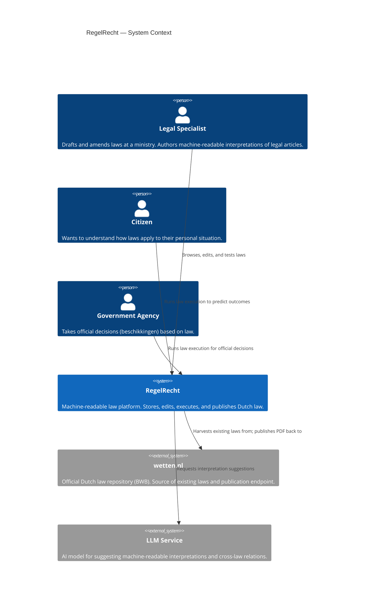
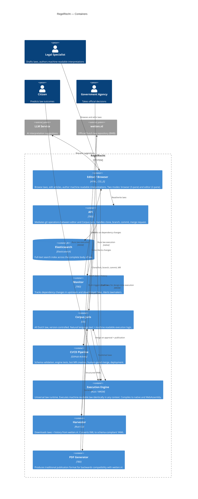
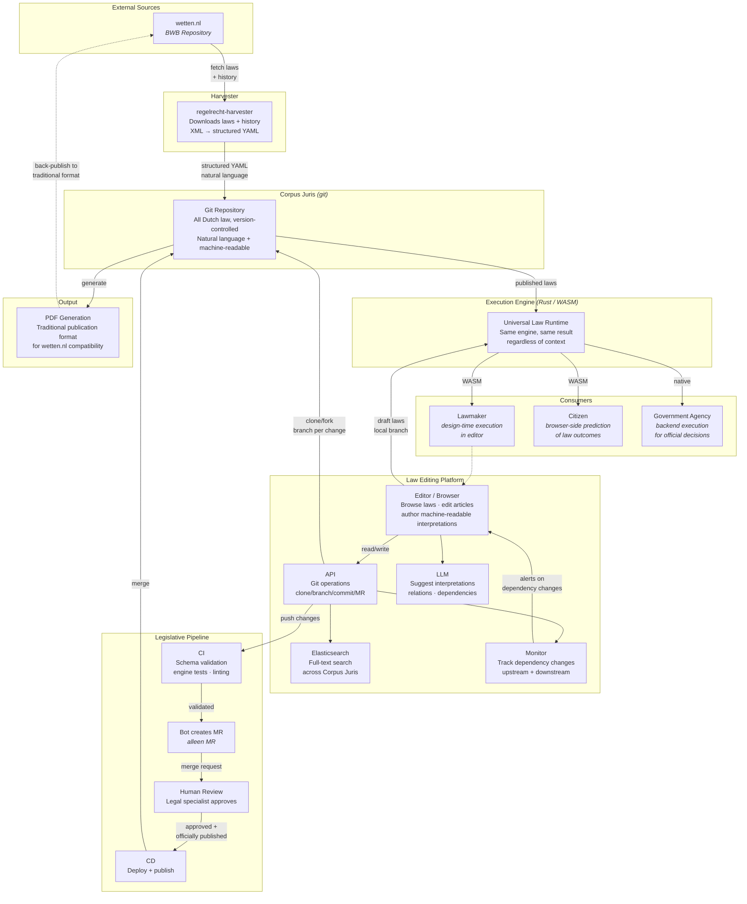

# System Overview

> **Work in progress.** This document describes the target architecture for RegelRecht. Not all components exist yet; see status notes per component below.
>
> Diagrams use [Mermaid](https://mermaid.js.org/). GitHub renders them natively; otherwise paste into the [Mermaid Live Editor](https://mermaid.live).

## C4 Level 1: System Context

These diagrams follow the [C4 model](https://c4model.com/) by Simon Brown. Level 1 shows who interacts with RegelRecht and what external systems it depends on. Level 2 zooms in to show the deployable containers.



## C4 Level 2: Container Diagram

The deployable units that make up RegelRecht.



## Detailed Architecture

The system centers on two pillars: the **Corpus Juris** — the complete body of Dutch law, git-versioned — and the **Execution Engine** — a universal runtime that executes machine-readable law identically in any context.



## Components

### Corpus Juris (git)

The single source of truth: all Dutch law, version-controlled in git. Contains both the natural language legal text and machine-readable execution logic per article. The git history captures the full legislative evolution. This is the project's core proposition — law as code, version-controlled.

**Status:** The current repo (`regulation/nl/`) contains a small number of laws. The vision is to grow this into the complete Corpus Juris.

### Execution Engine (`packages/engine`)

A universal law execution runtime, written in Rust. Executes machine-readable law articles and guarantees identical outcomes regardless of where it runs. The same engine serves:

- **Lawmakers** in the editor — design-time execution against draft laws on a local branch, comparing with published law, running Gherkin scenarios, or simulating against a (synthetic) population to see the effect of changes
- **Citizens** in the browser — predicting how laws apply to their situation ("am I eligible for zorgtoeslag?")
- **Government agencies** in backend systems — taking official decisions (beschikkingen)

Same engine, same law, same result. Compiles to both native (backend) and WebAssembly (browser).

Key internals:
- **LawExecutionService** — top-level API, loads laws, resolves cross-law references
- **RuleResolver** — law registry and output index for fast lookup
- **ArticleEngine** — single-article executor
- **Operations** — 16 operation types (arithmetic, comparison, logical, conditional)
- **RuleContext** — variable resolution with priority-based lookup
- **Trace** — execution audit trail for explainability

### Harvester (`packages/harvester`)

Backfills the Corpus Juris by crawling wetten.nl (the official BWB repository). Downloads laws by BWB ID, parses XML metadata and content, splits articles according to Dutch law hierarchy (Deel → Hoofdstuk → Paragraaf → Artikel → Lid), and writes schema-compliant YAML. Processes historical versions to reconstruct the full legislative timeline.

**Status:** In development on `feature/rust-harvester` branch.

### Editor / Browser (`frontend/`)

A single tool with two modes for legal specialists at ministries:

**Browser mode** — 3-pane layout:
- Left: Law navigation (search, favorites, recently viewed/edited)
- Middle: Law structure tree (Deel → Hoofdstuk → Paragraaf → Artikel)
- Right: Article detail with **Tekst / Machine / YAML** tabs, per Lid

**Editor mode** — 2-pane layout:
- Left: Rich text editor for legal text with formatting toolbar
- Right: Machine-readable interpretation per Lid (juridische basis, besluittype, definities, parameters, inputs, outputs, actions)
- Document tabs allow editing articles from multiple laws simultaneously (reflecting cross-law dependency work)
- "Bewerken" in browser mode opens an article in editor mode

### API

Mediates between the editor and the Corpus Juris. Handles all git operations: the editor works on a clone/fork of the CJ, with branches mapping to legislative proposals. A new law or amendment is a branch that proposes changes; merging represents official publication.

### Elasticsearch

Full-text search index across the Corpus Juris. Necessary because the complete body of Dutch law is too large for brute-force search.

### Monitor

Watches for changes in law dependencies. Since laws form extensive dependency chains (via cross-law references), a change in any upstream or downstream law needs to be flagged to the lawmaker working on a related law.

### LLM Integration

AI assistant embedded in the editor. Primary use case: suggesting machine-readable interpretations of legal text. May also suggest relations, dependencies, and cross-law references.

### Legislative Pipeline (CI/CD)

The git workflow mirrors the Dutch legislative process:

1. Lawmaker creates a branch (= legislative proposal)
2. **CI** validates: schema compliance, engine tests, linting
3. **Bot** creates a Merge Request (alleen MR — only MR, no direct pushes)
4. **Human review** — legal specialist approves
5. Final merge is gated on **official publication**
6. **CD** deploys and the change becomes part of the Corpus Juris

### PDF Generation

Backwards compatibility with the traditional publication process. If wetten.nl continues to work the old way, the system generates PDF output from the structured YAML format for traditional publication.

## Cross-Law References

Laws reference each other's outputs using the `regelrecht://` URI scheme:

```
regelrecht://{law_id}/{output_name}#{field}
```

The engine resolves these by finding the referenced law, executing the target article, and extracting the requested output field. Circular reference detection prevents infinite loops (max depth: 20 for cross-law, 50 for internal references).
