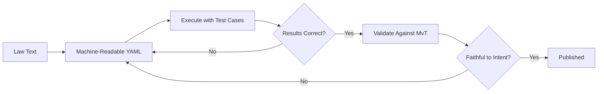

# Validation Methodology

RegelRecht uses an **execution-first** approach to validate machine-readable law interpretations.

## From Analysis-First to Execution-First

Traditional approaches analyze law text extensively before writing any code. RegelRecht inverts this:

### Why Execution-First?

Errors surface immediately through execution rather than after lengthy analysis. Test cases from the Memorie van Toelichting (MvT) provide ground truth. Each cycle improves the interpretation based on actual results. And after generation, every element is checked against the source text to catch hallucinated logic.

## The Loop: Generate, Validate, Reverse-Check

### 1. Generate

Create `machine_readable` sections for law articles, defining inputs, outputs, and operations.

### 2. Validate & Test

- Schema validation ensures structural correctness
- BDD scenarios (derived from MvT examples) verify behavioral correctness
- The engine executes the law and compares outputs to expected values

### 3. Reverse Validate

Every element in the machine-readable interpretation is traced back to the original legal text. Any logic that cannot be grounded in the law is flagged as potentially hallucinated.

## Memorie van Toelichting (MvT)

The MvT is the explanatory memorandum that accompanies Dutch legislation. It contains:

- The legislature's intent and reasoning
- Concrete examples of how the law should be applied
- Edge cases the legislature considered

These examples serve as the primary test cases for machine-readable interpretations.

## Beyond the automated loop

The automated loop above produces a candidate rule specification, but a candidate is not yet validated. Validation is organised around a *casus* — a real-world question with a defined scope of laws — not around a single law. On top of the loop, an expert review layer adds *annotations* (where review work lands), *hypotheses* (testable claims about how the law should behave), and a four-phase method that ensures both are resolved before a casus is signed off. See [Validation Methodology (full)](./validation-methodology.md) for the complete description.
