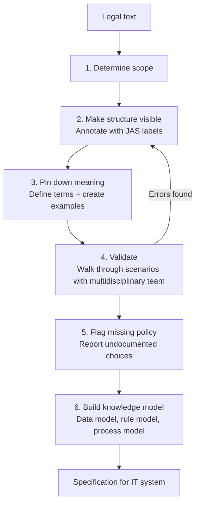
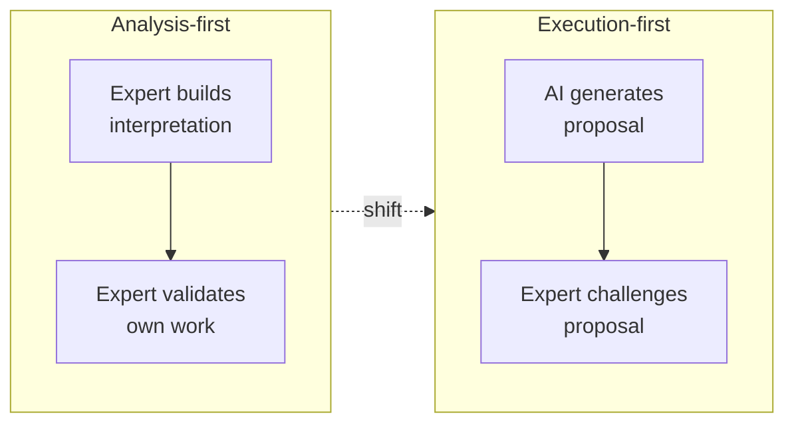
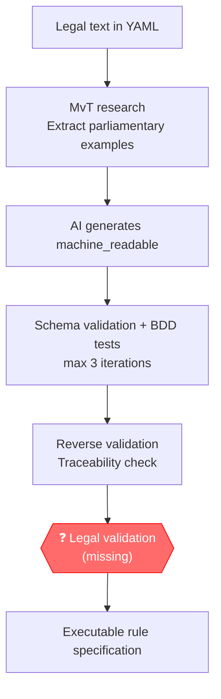
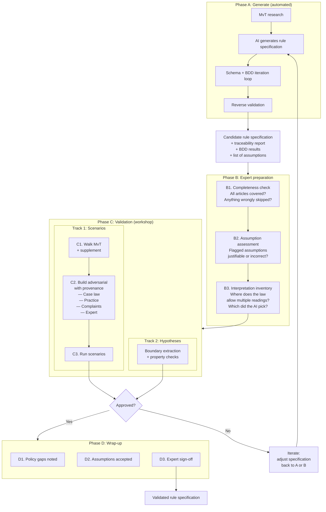
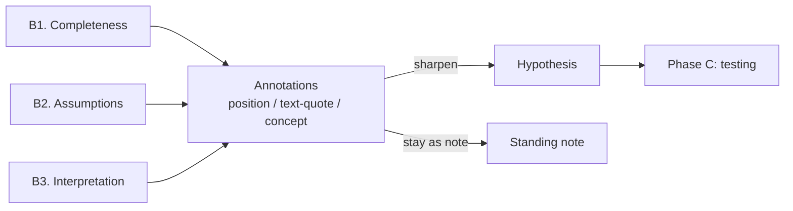
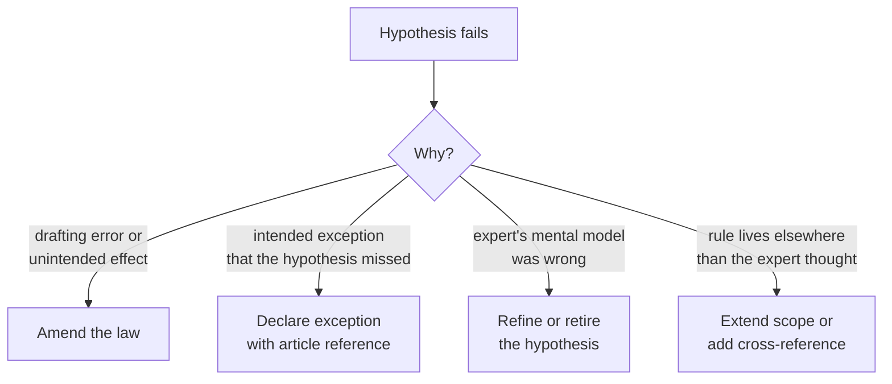
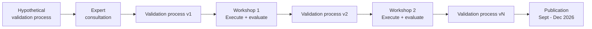

# RegelRecht Validation: From Analysis-First to Execution-First

## Problem statement

Turning law into working software is hard. For fifteen years, teams have worked in silos on methods, frameworks, and languages for formalizing legal rules. None of them scale.

This document traces the thread through those fifteen years, identifies the shift that RegelRecht makes, and proposes a validation method that fits the new way of working.

## Existing methods: an analysis-first tradition

### Wetsanalyse

Wetsanalyse is a legal analysis method developed in the practice of Dutch implementation agencies (Belastingdienst, UWV, DUO). The method is codified in the book *Wetsanalyse* (Ausems, Bulles & Lokin, 2021) and maintained by Lokin (Hooghiemstra & Partners) and Gort (ICTU).

The core of Wetsanalyse is the **Juridisch Analyseschema (JAS)**: a classification system of 13 element types that labels every formulation in legislation, from legal subject and legal relationship to derivation rule and condition.

The process has six steps:

Three characteristics define it:

1. **People do everything** — annotation, definition, modeling, and validation are all human work
2. **Validation checks your own work** — the multidisciplinary team reviews models it built itself
3. **Traceability is built in** — every element in the knowledge model points back to the source text in the law

The output is a knowledge model consisting of a data model (FBM/ER), rule model (DMN decision tables), and process model (BPMN). This model serves as the basis for building an IT system.

### Common ground across existing methods

Despite differences in terminology, existing methods follow the same pattern:

1. **Decomposition** — break the legal text into manageable units
2. **Identification** — recognize key concepts (who, what, when, what consequence)
3. **Interpretation** — explicitly record what the law means
4. **Modeling** — organize into data, rule, and process models
5. **Validation** — test against concrete scenarios and test cases
6. **Traceability** — trace every rule back to the source

All these methods are *analysis-first*: they start from the law and work toward a model or rule set. The translation is done entirely by people.

## RegelRecht: an execution ecosystem

RegelRecht is not just a method or a DSL. It is a broad execution ecosystem for making laws machine-executable. Three principles set it apart from the analysis-first tradition.

### Principle 1: Execution-first

Where existing methods share an analysis-first approach, RegelRecht aims to create a coherent system of machine-executable legislation. Laws interact across boundaries and citizens are not burdened with complexity.

The rule specification gets *single source of truth* status for how the law works. It is not an analysis layer that leads to a translation — the output of the analysis **is** the law in executable form.

### Principle 2: Transparent and simple

The execution-first starting point requires transparency: not just open source, but understandable to experts from different disciplines when they need to reach a joint decision on how laws work.

The core of the rule specification schema consists of simple logical operators that people can verify. No vendor lock-in, no convoluted stack of schemas.

### Principle 3: Scalable analysis

Existing methods laid the groundwork for dealing with the legal reality of machine-executability. That is an inherently interdisciplinary and intensive process.

Within the RegelRecht ecosystem, generative AI serves as a foundation: AI generates candidate rule specifications, and the analysis (or validation) runs against those candidates. This creates potential for faster and broader coverage.

## The shift: from building to challenging

AI changes the role of the legal expert:

| | Analysis-first | Execution-first |
|---|---|---|
| Who creates? | Human | AI |
| Who validates? | Same team | Legal expert |
| Cognitive task | Build + check | Challenge + judge |
| Traceability | Built in at creation | Checked after the fact |
| Interpretation choices | Explicitly documented | Implicit in AI output |
| Scale | Limited by human capacity | Limited by validation capacity |

The bottleneck moves from *creation* to *validation*. That makes validation the critical link.

### Risks of the shift

The shift introduces specific risks that do not exist in analysis-first:

- **Automation bias** — the tendency to accept AI output as correct
- **Anchoring** — the AI's proposal influences the expert's judgment
- **Blind spots** — the AI does not know what it does not know; neither does a reviewer who is not actively searching
- **Implicit interpretation choices** — where the law is ambiguous, the AI makes a choice without documenting it

## Problem identification: the missing link

The current RegelRecht ecosystem already has an automated pipeline:

The automated steps cover:
- **Structural correctness** — schema validation
- **Behavioral correctness** — BDD tests based on MvT examples
- **Traceability** — reverse validation checks whether every element points to the legal text

Three gaps need to be filled.

**Gap 1: a structured expert review process.** Today the pipeline ends with "expert please look at this." That is not a method. A structured process must give the expert something other than a long YAML file to react to, while avoiding the trap of reverting to Wetsanalyse-style building. The challenge is shaped by three constraints:

- The expert did not build the proposal — the mental model is absent
- The AI does not document its interpretation choices — they must be uncovered
- The scale demands an efficient process — not every law can take weeks

**Gap 2: a home for the review work itself.** Even with a process in place, the observations, doubts, and interpretation choices an expert encounters during review currently land in side documents or in memory. Without a structured artifact, that work cannot be tracked across versions, referenced from later runs, or revisited when the underlying law changes. Expert judgment that is not written down in a stable form decays.

**Gap 3: a broader base for the scenarios that test the specification.** MvT examples represent legislative intent and are indispensable as ground truth, but they are narrow. Case law, implementation practice, and citizen complaints surface classes of cases the MvT never anticipated. A method that only checks against MvT-derived scenarios will miss exactly the kind of edge cases that have caused the most consequential implementation failures in Dutch public administration.

## The casus as validation unit

Before describing the method itself, one structural choice deserves to be made explicit: the unit of validation is a *casus*, not a single law.

A casus is a real-world question — typically about how a citizen, household, or organisation should be treated under the law — together with the scope of laws that need to be consulted to answer it. A casus has an owner, a lifecycle, and one or more laws in scope. A law, by contrast, is a canonical artifact: it lives in the corpus regardless of who is asking which questions about it.

This distinction matters for three reasons.

**It matches how legal experts actually work.** Nobody works on "BWBR0029404" as such; they work on "the BES health insurance question". The casus is the cognitive unit where expert judgment lives, and the validation method should be organised around the same unit so that experts and the artifacts they produce stay aligned.

**System-spanning hypotheses become first-class.** Many of the most consequential questions in Dutch law cross multiple laws — how income is calculated for one regulation must be consistent with how it is calculated for another; when and where someone counts as *ingezetene* must hold across the entire stack of laws that depend on it. A law-scoped validation method treats these cross-law interactions as edge cases. A casus-scoped method treats them as the normal case, which they are.

**Cross-casus tensions surface system-level problems.** When the same law appears in multiple casussen, those casussen may carry implicit assumptions about how the law should behave. If those assumptions contradict each other, the validation method has found something that no per-law review could find: a system-level tension between two ways of using the same law. This is precisely the class of problem behind some of the most serious implementation failures in Dutch public administration.

The casus is therefore the primary container for the validation work described in the rest of this document. Laws remain canonical and casus-independent; one law may appear in many casussen, and that is desirable rather than something to manage away.

## Proposal: validation method in four phases

### Phase A: Generate (automated, existing)

This is the current pipeline. The AI generates a candidate rule specification and automated checks filter structural errors and untraceable elements. The output is not a finished product but a *proposal with documentation*:

- **Traceability report** — which elements are grounded in the legal text, which are assumptions
- **BDD results** — which MvT scenarios pass and fail
- **List of assumptions** — elements that do not follow directly from the text but are needed for execution
- **Concept extraction** — a list of concepts the AI identified in the law (definitions, key terms, parameters), with their occurrences and any cross-law links. This becomes the substrate for concept-anchored annotations in Phase B.
- **Boundary inventory** — every threshold, enum transition, and date cutoff that the machine-readable specification declares. This becomes the input for the hypothesis testing generator in Phase C, Track 2.

Concept extraction and the boundary inventory are not separate validation steps; they are byproducts of having a structured machine-readable specification. They cost almost nothing to produce and unlock work that would otherwise be unfeasible.

### Phase B: Expert preparation

The expert reviews the proposal *before* scenarios are run. This is the phase missing from the current pipeline and it draws on insights from Wetsanalyse:

**B1. Completeness check** — Are all articles covered? Did the AI skip articles that contain executable logic? This is analogous to the scope step (step 1) of Wetsanalyse, but after the fact: not "what will we analyze" but "has everything been analyzed."

**B2. Assumption assessment** — Reverse validation has flagged assumptions. The expert assesses each one: is this a defensible choice, or does it need to change? This addresses the risk of implicit interpretation choices.

**B3. Interpretation inventory** — Where does the law allow multiple readings? Which reading did the AI pick? Is it defensible? This is analogous to the meaning step (step 3) of Wetsanalyse, but reactive: not "what does this mean" but "is the AI's reading correct." This step counters automation bias.

**Annotations: where review work lands.** The output of B1, B2, and B3 takes the form of *annotations* — small, structured records of what the expert observed during review. Each annotation has a target, a type (gap, assumption concern, interpretation choice), an author, and a status. Annotations are first-class artifacts: they live alongside the law they refer to, are versioned with the corpus, and survive across reviews and across casussen. An observation that lands as an annotation can be revisited months later when the underlying law changes; an observation that only lives in someone's head cannot.

To be useful, annotations need to be precise about *what* they refer to, and laws change over time, so annotations support three kinds of anchor — an annotation may carry several at once:

- A **position anchor** points to an article, lid, or sentence by structural reference. It is human-readable but breaks silently if the article is renumbered.
- A **text-quote anchor** stores the literal phrase the expert was reacting to, with surrounding context. It is robust to small edits and breaks loudly when the text changes substantively, which here is a feature.
- A **concept anchor** points to an extracted concept — "verzekerde", "ingezetene", "besteedbaar inkomen" — rather than to a location. It follows the meaning rather than the place, which matters for terms that are defined in one law and used in many.

The concept anchor depends on a separate layer: a list of concepts extracted from the law, with their definitions, occurrences, and cross-law links. This layer is built alongside the machine-readable specification in Phase A. Concepts are themselves a form of structured knowledge about the law and earn their place even before any annotation refers to them.

**From annotation to hypothesis.** Some annotations are simply notes that need to stay visible. Others sharpen, over the course of a review, into testable claims about how the law should behave. When that happens, the annotation is *promoted* to a hypothesis — the artifact that drives Phase C testing. The original annotation is not discarded; it remains as the lineage of the hypothesis, so that the question "where did this hypothesis come from?" always has a recorded answer. Most annotations will never promote, and that is fine. The point is that the promotion path exists and is traceable in both directions.

### Phase C: Validation (workshop)

The expert validates the *behavior* of the specification, not the YAML itself. Phase C runs two complementary tracks: scenarios test specific cases against expected outcomes; hypotheses test whole classes of cases against expected properties.

#### Track 1: Scenario validation

**C1. Walk through MvT scenarios** — The engine runs scenarios derived from parliamentary documents. The expert checks whether outcomes match legislative intent. MvT examples are treated as ground truth: if the engine disagrees, the specification is wrong.

MvT examples are valuable but rarely cover everything. They tend to be few, illustrate only headline cases, and sometimes leave parameter values implicit. C1 therefore includes a supplementation step: variations around the MvT examples (same case, different inputs) and new cases for clauses the MvT does not illustrate. Supplementation raises a trust question — where does the expected outcome of a supplemented case come from? When the MvT states a principle clearly, the principle itself can serve as the oracle. When it does not, the expected outcome must come from a separate source: a declared hypothesis (Track 2), an independent expert judgment, or a related law that addresses the same case.

**C2. Build adversarial scenarios** — The AI has no access to case law, implementation practice, or political context. The expert builds scenarios that stress-test the specification, drawing from sources beyond the MvT:

- **Case law** — judgments where the law was applied differently than parties expected; an empirical record of where the law has been read ambiguously
- **Implementation practice** — work instructions and policy rules from executing organisations, which capture cases the law does not explicitly mention but that occur daily
- **Citizen objections and complaints** (anonymised) — interpretive grey zones where the law and lived experience diverge
- **Expert construction** — boundary values, "unless" clauses, concurrence between laws, and edge cases the expert constructs by hand

Every scenario carries a *provenance label* identifying its source. Without a source, an "adversarial scenario" is indistinguishable from an unsourced expert intuition, and the method needs to be able to defend why a case was tested and what the expected outcome was based on.

**C3. Run adversarial scenarios** — The engine runs them. The expert checks the outcomes. Errors lead to iteration.

#### Track 2: Hypothesis testing

Track 2 asks a different question. Rather than "does the engine handle this specific case correctly?", it asks "does this whole class of cases behave the way I would expect it to?".

**A hypothesis is a belief, not an invariant.** A hypothesis is a legal expert's explicit claim about how the law should behave — for example, that the own contribution should never increase as income decreases, or that two cases differing only in an irrelevant attribute must produce the same outcome. Critically, a hypothesis is *not* a fact the law must obey. It gets tested against the executable law, and both sides can be wrong: the law may contain a drafting error, or the expert may have a naive mental model of the field. The dialectic between the two is the point.

**Where hypotheses come from.** Three sources:

- **Promoted annotations** — observations from Phase B that sharpened into testable claims
- **Domain-level invariants** — properties that hold across an entire field of law (rechtsgebied), such as monotonicity in income-dependent benefits or proportionality in punitive measures. These are not specific to any single casus; they capture expertise about how a whole field of law should behave. They are written down once, in a shared library for that field, and every casus that falls within it automatically inherits them. A new casus in social security does not need to redeclare monotonicity — it gets tested against it for free.
- **Universal properties** — claims that hold for any law (determinism, the requirement that every output be traceable to an article); these live in the engine itself

**How hypotheses are tested.** A generator turns a hypothesis into automated checks in two steps.

*First*, it scans the machine-readable YAML and finds every place where the law makes a discontinuous decision: an income threshold (€23.000), an age boundary (the day someone turns 18), a date cutoff (rules valid from a specific date), an enum transition. These are the *boundaries* — the places where small changes in input can produce different outcomes, and therefore the places where bugs are most likely to hide. The generator builds a list of test inputs that sit just on either side of every boundary it finds.

*Second*, for each test input it runs the engine and checks whether the hypothesis still holds. For a monotonicity hypothesis like "own contribution never increases as income decreases", the generator picks pairs of test inputs that differ only in income, runs the engine on both, and compares the outputs. If anywhere in this test set the relation is violated, the generator has found a counterexample.

When a counterexample is found, the generator does one more thing: it *shrinks* the input to the minimal failing case. Instead of reporting "household of 4 with income €23.471 on 13 July 2025", it reports "single adult, income €12.000 versus €12.001 — outputs differ in the wrong direction". The minimal counterexample is the only form an expert can usefully reason about, because it strips away everything that is irrelevant to the failure.

The generator is therefore a third source of scenarios, alongside the human-authored cases from C2 and the LLM-authored cases that supplement C1. The difference is the kind of provenance each carries: a C2 scenario points to an external source (a judgment, a work instruction, a parliamentary example), while a generator scenario points to a structural feature of the law itself (a threshold in art. 5 lid 2).

What determines trust in any of these is not whether a scenario is "adversarial" or "typical", but where its *expected outcome* comes from. A scenario whose expected outcome is produced by the same source as the case — most starkly, an LLM that synthesises both the input and the answer — is tautological: it can only catch bugs the source did not already share. A scenario whose expected outcome comes from an independent source — a judgment, a written-down hypothesis, an MvT principle, an expert who has not seen the AI's interpretation — is the form that actually validates anything. This is why hypothesis testing in Track 2 has value beyond what scenarios alone can offer: it provides an oracle that exists independently of the case under test.

**Four resolutions for a failing hypothesis.** When a hypothesis fails, the finding is never "the test is broken." The divergence between belief and behaviour is real, and exactly one of four things must happen next:

Only the first resolution changes the law itself. The other three lead to richer, more explicit artifacts — declared exceptions, refined hypotheses, or new cross-references — without the law changing at all. None of the four is "looks fine, sign it off". A hypothesis that fails always forces a choice, which is the discipline that makes rubber-stamping cognitively impossible.

### Phase D: Wrap-up

Analogous to the policy-gap step (step 5) of Wetsanalyse, but with additional gates that ensure the artifacts produced during Phases B and C have actually been resolved:

- **Policy gaps** are noted — where the law underspecifies and a choice was made
- **Assumptions** are formally accepted or rejected
- **Annotations** are all in an end-state — resolved, promoted to a hypothesis, escalated, or explicitly accepted with stated reasoning. Sign-off is blocked by open annotations of severity medium or higher.
- **Hypotheses** are all in an end-state — passing on the current version of the law, retired with a reason, or refined into a successor. A casus that signs off with failing hypotheses must declare an explicit reason for each one.
- **Refinements** are logged — every divergence found during Phases B and C, together with its resolution path, becomes part of the casus history. This is the record of what the validation actually learned, not just whether it succeeded.
- **Expert sign-off** is recorded

## Design principles of the method

### The casus is the validation unit

Validation is organised around a casus — a real-world question with a defined scope of laws — not around a single law. Laws are canonical artifacts; casussen are the contexts in which legal expertise is applied. Organising validation around the casus matches how legal experts actually work, makes system-spanning hypotheses first-class, and surfaces tensions between different ways of using the same law.

### The expert does not read YAML

The expert reviews *reports* and *outcomes*, not the specification itself. The automated pipeline delivers:
- A traceability report in readable form
- Scenario outcomes with references to legal articles
- A list of assumptions and interpretation choices

### Validation means challenging, not building

The difference with Wetsanalyse validation matters: the expert did not build the proposal and must actively search for errors. The method structures that search by explicitly asking for adversarial scenarios.

### A hypothesis is a belief, not a fact

A hypothesis records what an expert *thinks* the law should do, and is then tested against what the law *actually* does. Both can be wrong: the law may contain a drafting error, or the expert may have a naive mental model. The dialectic between belief and behaviour is the point. A hypothesis is never a stick to beat the law with; it is a question that the validation method is allowed to answer either way.

### Annotations are the seedbed of hypotheses

Expert observations during review — doubts, gaps, interpretation choices — are recorded as annotations rather than left in side documents or memory. Some annotations sharpen into testable hypotheses and feed Phase C; most remain as standing notes. The point is that the path exists and is traceable in both directions: every hypothesis has a recorded origin, and every annotation that becomes a hypothesis leaves a backref.

### MvT examples are ground truth

Worked examples from the Memorie van Toelichting represent the legislature's intent. If the engine produces a different result than the MvT example, the specification is wrong — not the example.

### The method is iterative

The method itself is developed via a Design Science Research approach:
1. Design a hypothetical validation process based on insights from Wetsanalyse and Human-GenAI interaction
2. Present it to experts from the legal domain
3. Run the process in workshops with real cases
4. Evaluate and iterate
5. Publish findings

## Comparison with Wetsanalyse

| Wetsanalyse step | RegelRecht equivalent | Difference |
|---|---|---|
| 1. Determine scope | Casus definition + Phase A: select laws | Single law → casus that may span multiple laws |
| 2. Structure annotation (JAS) | AI generates machine_readable | Human → AI |
| 3. Pin down meaning | B3 + concept extraction | Proactive → reactive |
| 4. Validate with scenarios | Phase C: Track 1 scenarios + Track 2 hypotheses | Own work → someone else's proposal; specific cases → cases plus invariants |
| 5. Flag policy gaps | Phase D: policy gaps + declared exceptions from failed hypotheses | Same; new channel via hypothesis failures |
| 6. Build knowledge model | Phase A: machine_readable YAML + concepts + boundaries | Human → AI; richer outputs |

The method keeps the discipline of Wetsanalyse (traceability, scenarios, policy gaps) but adapts the execution to the reality that the expert *judges* rather than *builds*.

## Approach and planning

- **Consultation** with experts from the legal domain (Wetsanalyse) for the design of the validation method
- **Workshops** where the process is run on real cases and evaluated
- **Iteration** of the method based on findings (Design Science Research)
- **Publication** of findings: September–December 2026
